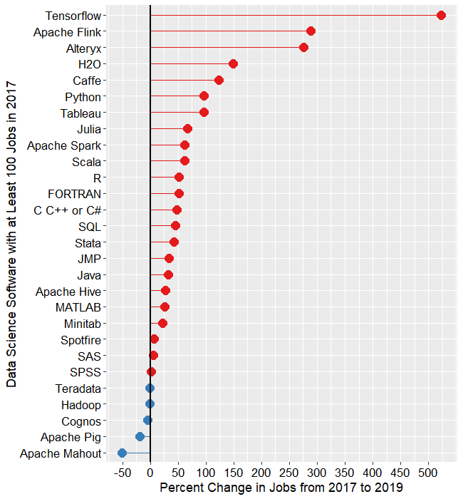

```{r xaringan-themer, include=FALSE, warning=FALSE}
require(xaringanthemer)
require(xaringanExtra)
style_duo(primary_color = "#e3e3e2", secondary_color = "#a6873b")
```

```{r xaringan-panelset, echo=FALSE}
xaringanExtra::use_panelset()
```

class: title-slide, right, top
background-image: url(img/canopy_logo.png)
background-size: 50%, cover

.right-column[
# `r rmarkdown::metadata$title`
### `r rmarkdown::metadata$subtitle`

**`r rmarkdown::metadata$author`**<br>
`r rmarkdown::metadata$institute`<br>
`r rmarkdown::metadata$date`
]


---
background-image: url(img/canopy_logo.png)
background-size: 14%, cover
background-position: 99% 4%

# .center[Why R?]

.pull-left[
## R/ R Studio

- Free
- Open Source
- Large User Base/Community
- Cutting-Edge Statistics
- Reproducibility
- Version Control/Collaboration
]

.pull-right[
## R Markdown

- Reproducibility
- Communication
]


---
background-image: url(img/canopy_logo.png)
background-size: 14%, cover
background-position: 99% 4%

class: center

# Growth of R

.panelset[
.panel[.panel-name[Jobs - 2017 & 2019]

<figcaption>Figure from [The Popularity of Data Science Software](https://r4stats.com/articles/popularity/)</figcaption>
] <!---->

.panel[.panel-name[Job Change 2017 - 2019]

<figcaption>Figure from [The Popularity of Data Science Software](https://r4stats.com/articles/popularity/)</figcaption>
] <!---->

.panel[.panel-name[Primary Tool]

<figcaption>Figure from [The Popularity of Data Science Software](https://r4stats.com/articles/popularity/)</figcaption>
] <!---->

.panel[.panel-name[1995 - 2016 Articles]

<figcaption>Figure from [The Popularity of Data Science Software](https://r4stats.com/articles/popularity/)</figcaption>
] <!---->

.panel[.panel-name[2018 Articles]

<figcaption>Figure from [The Popularity of Data Science Software](https://r4stats.com/articles/popularity/)</figcaption>
] <!---->

] <!--end of panelset-->


---
background-image: url(img/canopy_logo.png)
background-size: 14%, cover
background-position: 99% 4%

# .center[You Can Do Cool Stuff In R]

.pull-left[
<br> <br>
- [Generative Art](https://www.data-imaginist.com/art) <br> <br>
- [Websites](https://www.silviacanelon.com/about/) <br> <br>
- [Data Visualization](https://www.cedricscherer.com/top/dataviz/) <br> <br>
- [Create Resumes](https://twitter.com/NicholasStrayer/status/1178754342289121280/photo/1) <br> <br>
]

.pull-right[
<br> <br>
- [Generative Art](https://www.data-imaginist.com/art) <br> <br>
- [Websites](https://www.silviacanelon.com/about/) <br> <br>
- [Data Visualization](https://www.cedricscherer.com/top/dataviz/) <br> <br>
- [Create Resumes](https://twitter.com/NicholasStrayer/status/1178754342289121280/photo/1) <br> <br>
]


---
background-image: url(img/canopy_logo.png)
background-size: 14%, cover
background-position: 99% 4%

# .center[History of R]

.right-column[
- R is a descendent of the S programming language
- S was developed at the Bell Telephone Laboratories in 1976
- S was designed for data analysis, but with the goal that *users* would become *developers*
- In 1988, the third version of S (S3) was rewritten in C and began to resemble the R language in use today.  
    - S4 was later released in 1998
- R was created in 1991 by Ross Ihaka and Robert Gentleman
- R was released using a GNU General Public License in 1995, ensuring that it would remain free and open source
- In 2001, R version 1.0.0 was released to the public
- The most recent version of R is 4.2.0, which was released on 2022-04-22
]

.left-column[

<figcaption>Robert Gentleman<figcaption>


<figcaption>Ross Ihaka<figcaption>
]