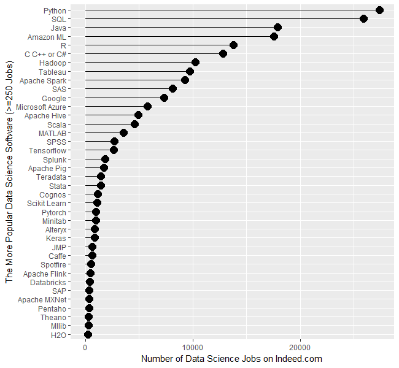
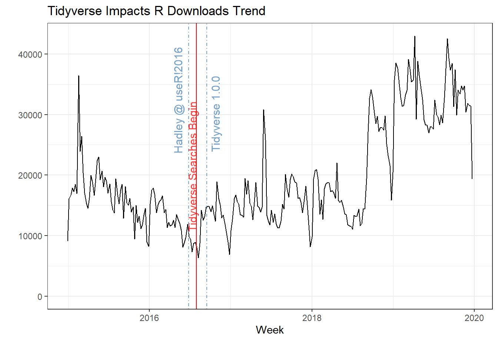
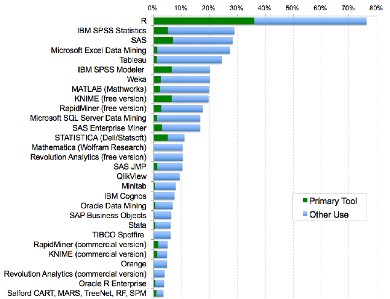
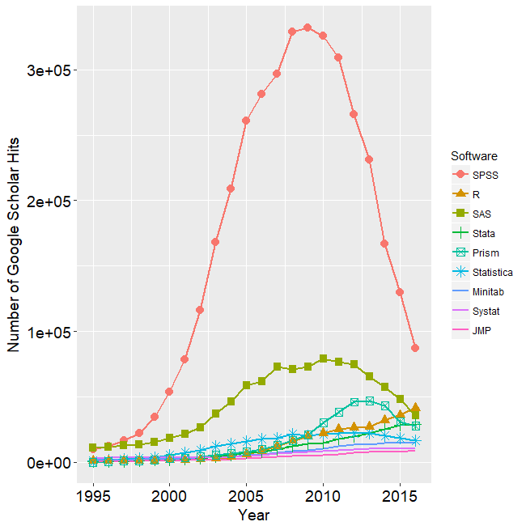
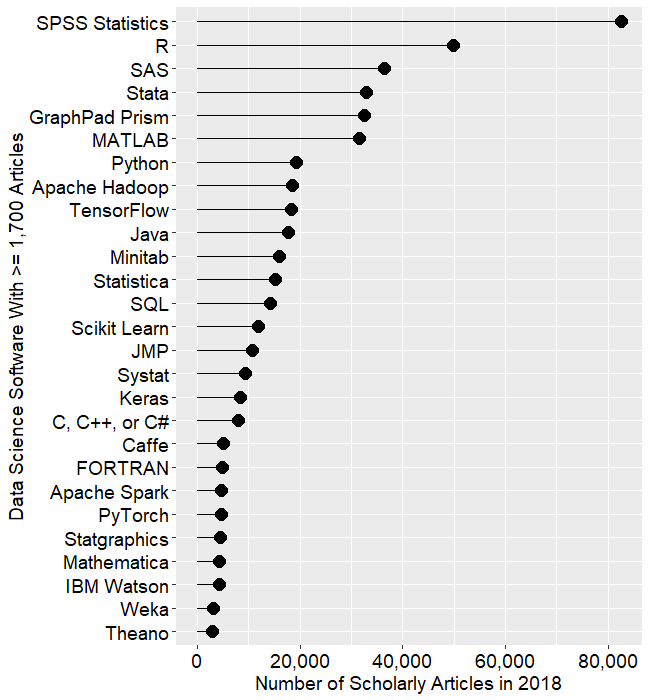
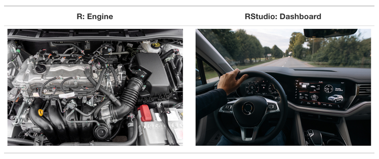
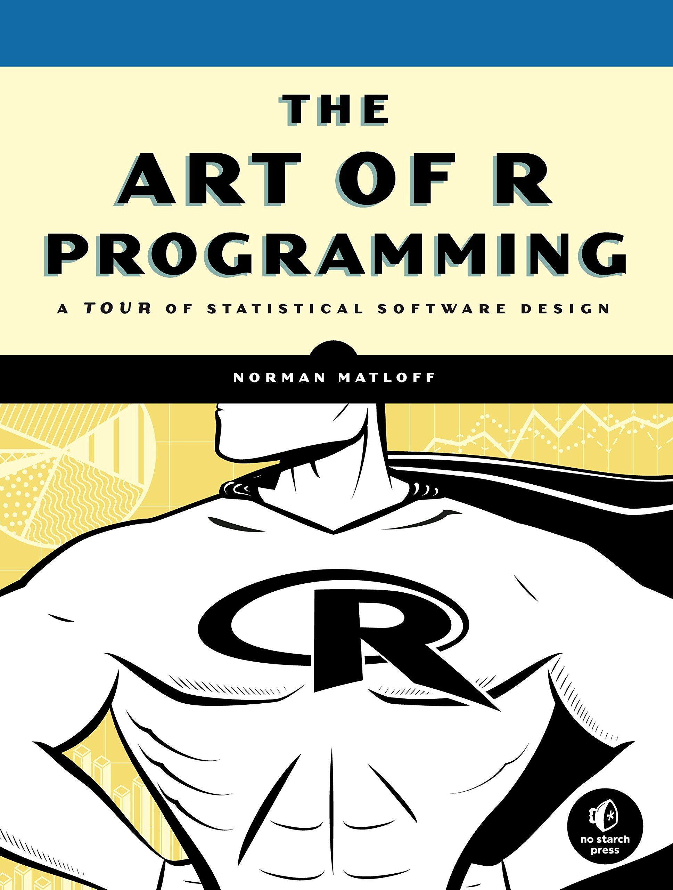
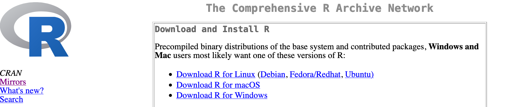

```{r xaringan-themer, include=FALSE, warning=FALSE}
require(xaringanthemer)
require(xaringanExtra)
style_duo(primary_color = "#e3e3e2", secondary_color = "#a6873b")
```

```{r xaringan-panelset, echo=FALSE}
xaringanExtra::use_panelset()
xaringanExtra::use_tile_view()
```

class: title-slide, right, top
background-image: url(img/canopy_logo.png)
background-size: 50%, cover

```{r xaringan-logo, echo=FALSE}
xaringanExtra::use_logo(
  image_url = "img/canopy_logo.png",
  position = xaringanExtra::css_position(top = ".5em", right = ".5em"),
  height = "140px",
  width = "160px",
  exclude_class = c("title-slide", "inverse", "hide_logo")
)
```


.right-column[
# `r rmarkdown::metadata$title`
### `r rmarkdown::metadata$subtitle`

**`r rmarkdown::metadata$author`**<br>
`r rmarkdown::metadata$institute`<br>
`r rmarkdown::metadata$date`
]


---
class: inverse, center, middle

# Introduction


---
# .center[Why R?]

.pull-left[
- Free <br> <br>
- Open Source <br> <br>
- Large User Base/Community <br> <br>
- Cutting-Edge Statistics <br> <br>
- Reproducibility <br> <br>
- Version Control/Collaboration <br> <br>
- Communication <br> <br>
]

.pull-right[

]


---
class: center

# Growth of R

.panelset[
.panel[.panel-name[Jobs - 2017 & 2019]

<figcaption>Figure from [The Popularity of Data Science Software](https://r4stats.com/articles/popularity/)</figcaption>
] <!---->

.panel[.panel-name[User Base]

<figcaption>Figure from [R's Demise is Highly Overblown](https://www.alfredogmarquez.com/2019/12/29/r-s-demise-higly-overblown/)</figcaption>
] <!---->

.panel[.panel-name[Primary Tool]

<figcaption>Figure from [The Popularity of Data Science Software](https://r4stats.com/articles/popularity/)</figcaption>
] <!---->

.panel[.panel-name[1995 - 2016 Articles]

<figcaption>Figure from [The Popularity of Data Science Software](https://r4stats.com/articles/popularity/)</figcaption>
] <!---->

.panel[.panel-name[2018 Articles]

<figcaption>Figure from [The Popularity of Data Science Software](https://r4stats.com/articles/popularity/)</figcaption>
] <!---->

] <!--end of panelset-->


---
# .center[You Can Do Cool Stuff In R]

.pull-left[
<br> <br>
- [Generative Art](https://www.data-imaginist.com/art) <br> <br>
- [Websites](https://www.lucymcgowan.com/) <br> <br>
- [Data Visualization](https://www.cedricscherer.com/top/dataviz/) <br> <br>
- [Resumes](https://twitter.com/NicholasStrayer/status/1178754342289121280/photo/1) <br> <br>
]

.pull-right[
<br> <br>
- [Books](https://r4ds.had.co.nz/index.html) <br> <br>
- [Slides](https://spcanelon.github.io/xaringan-basics-and-beyond/) <br> <br>
- [Shiny Apps](https://shiny.rstudio.com/gallery/) <br> <br>
- [Interactive Visualizations](https://rpsychologist.com/pvalue/) <br> <br>
]


---
# .center[Why Not R?]

.left-column[
<br>
<br>
- Learning Curve <br> <br>
- Ever-Expanding Ecosystem <br> <br>
- Validation? <br> <br>
- Opinionated <br> <br>
]

.right-column[

.caption[
Figure from [Gergely Daróczi](https://gist.github.com/daroczig/3cf06d6db4be2bbe3368)
]
]


---
class: inverse, middle, center

# Overview


---
# .center[History of R]

.right-column[
- R is a descendent of the S programming language
- S was developed at the Bell Telephone Laboratories in 1976
- S was designed for data analysis, but with the goal that *users* would become *developers*
- In 1988, the third version of S (S3) was rewritten in C and began to resemble the R language in use today.  
    - S4 was later released in 1998
- R was created in 1991 by Ross Ihaka and Robert Gentleman
- R was released using a GNU General Public License in 1995, ensuring that it would remain free and open source
- In 2001, R version 1.0.0 was released to the public
- The most recent version of R is 4.2.0, which was released on 2022-04-22
]

.left-column[

<figcaption>Robert Gentleman<figcaption>


<figcaption>Ross Ihaka<figcaption>
]


---
# .center[R vs. R Studio]

.pull-left[.center[
## R 
.bullets[
A programming langauge <br>
A console <br>
Runs computations <br>
]

<br>
DON'T USE THIS ONE!
]]

.pull-left[.center[
## R Studio
An add-on that integrates with R <br>
Creates a more user-friendly interface <br>
An **Integrated Development Environment (IDE)**


<br>
USE THIS ONE!
]]


---
class: center

# R vs. R Studio

.middle[

.caption[
Figure from [Modern Dive](https://moderndive.com/1-getting-started.html)
]
]


---
class: center, middle

# Let's Tour R and R Studio!


---
.center[
# R Syntaxes
]

.pull-left[
## Base R
- The original R syntax
- All the functionality that's pre-loaded when you open an R session
- Core packages: `base`, `compiler`, `datasets`, `graphics`, `grDevices`, `grid`, `methods`, `parallel`, `splines`, `stats`, `stats4`, `tcltk`, `tools`, `translations`, `utils`
.center[

]
]

.pull-right[
## Tidyverse
- Released in 2016
- A suite of add-on packages that follow a coherent programming style
- Core packages: `dplyr`, `ggplot2`, `tidyr`, `readr`, `purrr`, `tibble`, `stringr`, `forcats`
<br>
<br>

.center[

]
]


---

.center[
# Objects, Functions, and Packages
]

.pull-left[
- **Object** - A named listing of information that you can call up
  - can be a single number, a plot, a dataframe, a model, etc.
  -  in R, everything is an object!
- **Function** - an encoded set of instructions for acting upon objects
  - e.g., `mean`, `sum`, `plot`, etc.
  - functions are also objects!
- **Package** - a collection of functions that are bundled together
  - typically, functions in a pacakge accomplish a similar set of tasks
  - e.g., `ggplot2` is a package (bundle of functions) that is focused on data visualization
]

.pull-right[
```{r}
x <- c(3, 7, 5)
x
sum(x)

mean(x)
```

]


---

.center[
# Where Do Packages Come From?
]

.pull-left[
- Packages are developed by R users
- They're submitted and stored on the Comprehensive R Archive Network (CRAN) for public use
- Other R users can then download those packages onto their own computers (using `install.packages`)
- To use the functions within a package, the package needs to be loaded during an R session (using `require` or `library`)
]

.pull-right[
<br>
<br>
<br>
```{r eval = FALSE}
install.packages("tidyverse")
```

<br>

```{r eval = FALSE}
require(tidyverse)
library(tidyverse)
```

]

<br>

.center[

]

---
class: inverse, center, middle

# Concluding Remarks


---
.center[
# Where have we been?
]

.pull-left[
<br>
- R is a free and **open source** statistcal software
- **R users** are also **R developers**
- R developers create **packages** of **functions** that are uploaded onto **CRAN**
- We (R users) can download those packages from CRAN onto our computers
- R studio is an **integrated development environment** that has helpful tools and features that make using R easier
- We'll use R Studio to communicate with R and use the cool stuff that R developers have created to **create cool stuff** of our own
]

.pull-right[
<br>
.center[

]
]


---
<br>

.center[

]

.left[
### A quick journey through Base R...
]

.right[
### ...And then off to the Tidyverse
]
