```{r xaringan-themer, include=FALSE, warning=FALSE}
require(xaringanthemer)
require(xaringanExtra)
require(icons)
require(palmerpenguins)
require(tidyverse)
style_duo(primary_color = "#e3e3e2", 
          secondary_color = "#a6873b",
          code_inline_color = "#746850",
          text_font_size = "1.1rem",
          header_font_google = google_font("Lato"),
          text_font_google   = google_font("Lora"),
          code_font_google   = google_font("Space Mono")
          )
```

```{r xaringan-panelset, echo=FALSE}
xaringanExtra::use_panelset()
xaringanExtra::use_tile_view()
xaringanExtra::use_clipboard()
xaringanExtra::use_scribble()
xaringanExtra::use_search(show_icon = FALSE)
xaringanExtra::use_extra_styles(
  hover_code_line = TRUE,         #<<
  mute_unhighlighted_code = TRUE  #<<
)
```

class: title-slide, right, top
background-image: url(img/hex_dplyr.png), url(img/canopy_logo.png)
background-position: 93% 63%, 50% 50%
background-size: 10%, 50%

```{r xaringan-logo, echo=FALSE}
xaringanExtra::use_logo(
  image_url = "img/canopy_logo.png",
  position = xaringanExtra::css_position(top = ".5em", right = ".5em"),
  height = "140px",
  width = "160px",
  exclude_class = c("title-slide", "inverse", "hide_logo")
)
```


.right-column[
# `r rmarkdown::metadata$title`
### `r rmarkdown::metadata$subtitle`

**`r rmarkdown::metadata$author`**<br>
`r rmarkdown::metadata$institute`<br>
`r rmarkdown::metadata$date`
]


---
class: inverse, center, middle


# Relational Data!
----
`r icons::icon_style(icons::fontawesome("r-project"), scale = 3, fill = "white")`


---

.center[
# Relational Data Overview
]

- Functions in this module will be used to combine multiple tables of data <br> <br>
- **Relational data**: multiple tables of data that are defined by the relations between them
   - dataset1 has IDs, demographics, and treatment assignment
   - dataset2 has IDs and outcomes <br> <br>
- Three families of verbs designed to work with relational data
   1. **Mutating joins**: add new variables to one data frame from matching observations in another
   1. **Filtering joins**: filter observations from one data frame based on whether or not they match an observation in the other table
   1. **Set Operations**: treat observations as if they were set elements 
   
---

.center[
# nycflights13 data
]

```{r echo = FALSE}
require(nycflights13)
```


.panelset[

.panel[.panel-name[flights]

```{r echo = FALSE}
flights %>% 
  head(n = 100) %>% 
  DT::datatable(options = list(
  scrollY = 300,
  scrollX = 300,
  pageLength = 5,
  dom = "ltp",
  ordering = FALSE))
```

]<!---->


.panel[.panel-name[airports]

```{r echo = FALSE}
airports 
```

]<!---->

.panel[.panel-name[planes]

```{r echo = FALSE}
planes
```
]<!---->


.panel[.panel-name[weather]

```{r echo = FALSE}
weather
```
]<!---->

.panel[.panel-name[airlines]

```{r echo = FALSE}
airlines
```
]<!---->


.panel[.panel-name[Relationships]

.center[
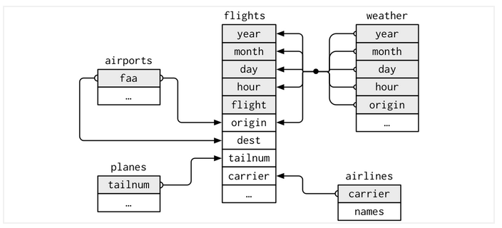
.caption[
From [R for Data Science](https://r4ds.had.co.nz/relational-data.html)
]
]

]<!---->

]<!--end panelset-->


---
class: inverse, center, middle


# Keys!
----
`r icons::icon_style(icons::fontawesome("r-project"), scale = 3, fill = "white")`


---

.center[
# Key Variables
]

- **Keys**: the variables used to connect each pair of tables
   - A variable (or set of variables) that uniquely identifies an observation
- In simple cases, a single variable is sufficient to identify an observation
   - each plane is uniquely identified by `tailnum`
- In more complex cases, multiple variables are needed to identify an observation
   - to identify an observation in `weather`, you need five variables: `year`, `month`, `day`, `hour`, and `origin` <br> <br>
- Two types of keys
   - **Primary Key**: uniquely identifies an observation in its own table
      - e.g., `flights$tailnum` identifies each plane in the `planes` table
   - **Foreign Key**: uniquely identifies an observation in another table
      - e.g., `flights$tailnum` appears in the `flights` table where it matches each flight to a unique plane
- A primary key and the corresponding foreign key in another tabale form a **relation**


---

.center[
# Does this key uniquely identify an observation?
]

- Once you'd identified a primary key, it's good practice to verify that it uniquely identifes each observation
- You can use `count()` to do this:
   - `count()` will calculate the frequency of each instance of the primary key
   - if the frequency (`n`) is greater than 1, you haven't uniquely identified each observation

```{r}
planes %>% 
  count(tailnum) %>% 
  filter(n > 1)
```


---

.center[
# Surrogate Keys
]

- In rare instances, there is no primary key in a table
- You'll need to create a **surrogate key** in this instance
- Use `mutate()` and `row_number()`

```{r}
flights %>% mutate(key = row_number()) %>% select(tailnum, year, month, day, key) %>% head(5)
```


---

.center[
# Now You Try!
]

- Install the `Bahman` package
- Identify the keys in the Batting dataset <br> <br> <br>

- Install the `babynames` package
- Identify the keys in the babynames dataset <br> <br> <br>


---

.center[
# Solution
]

```{r cache=TRUE}
Lahman::Batting %>% 
  count(playerID, yearID, stint) %>% 
  filter(n > 1)
```

```{r cache=TRUE}
babynames::babynames %>%
  count(year, sex, name) %>%
  filter(n > 1)
```


---
class: inverse, center, middle


# Mutating Joins!
----
`r icons::icon_style(icons::fontawesome("r-project"), scale = 3, fill = "white")`


---

.center[
# Overview of Mutating Joins
]

- Allow you to combine variables from two tables
   - first matches observations by their keys
   - then copies across variables from one table to the other
- Like `mutate()`, join functions add variables to the right
- Let's make a smaller flights dataset for presenation purposes

```{r}
flights2 <- flights %>% 
  select(year:day, hour, origin, dest, tailnum, carrier)
head(flights2, n = 3)
```


---

.center[
# left_join()
]

- `left_join()` is the most common join
- Adds new variables from a second table to the right of a first table
- Let's `left_join()` the `airlines` table to the `flights2` table

```{r}
flights2 %>%
  left_join(airlines, by = "carrier") %>% 
  head(n = 5)
```


---

.center[
# How Do Joins Work?
]

.pull-left[
- Imagine we have two tables, `x` and `y`
   - colored columns = key variables
   - gray columns = values <br> <br>
- A join is a way to connect reach row in `x` to zero, one or more rows in `y`
- the diagram to the right shows each potential match as an intersection of lines <br> <br>
- In an actual join, matches will be indicated with dots.
   - The number of dots = the number of matches = the number of rows in the output.
]


.pull-right[
.left[
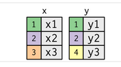
]
.left[
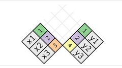
]
.left[
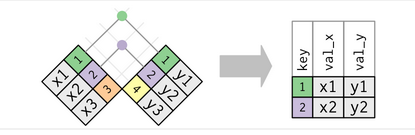
.caption[
From [R for Data Science](https://r4ds.had.co.nz/tidy-data.html)
]
]
]


---

.center[
# Inner Joins
]

.pull-left[
- The simplest type of join is an inner join <br> <br>
- An inner join matches pairs of observations whenever their keys are equal <br> <br>
- The output of an inner join is a new data frame that contains the key, the x values, and the y values. 
   - We use `by` to tell dplyr which variable is the key <br> <br>
- The most important property of an inner join is that unmatched rows are not included in the result.
]

.pull-right[
<br>
<br>
<br>
.center[
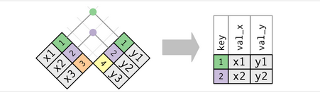
.caption[
From [R for Data Science](https://r4ds.had.co.nz/tidy-data.html)
]
]
]


---

.center[
# Inner Joins in Action!
]

.panelset[

.panel[.panel-name[Create Data]

.pull-left[
```{r}
x <- tribble(
  ~key, ~val_x,
     1, "x1",
     2, "x2",
     3, "x3"
)
y <- tribble(
  ~key, ~val_y,
     1, "y1",
     2, "y2",
     4, "y3"
)
```
]

.pull-right[

.pull-left[
```{r echo = FALSE}
x %>% 
  knitr::kable()
```

]

.pull-right[
```{r echo = FALSE}
y %>% 
  knitr::kable()
```

]

<br>
.center[

]
]


]<!---->

.panel[.panel-name[Inner Join]

```{r eval = FALSE}
x %>% 
  inner_join(y, by = "key")
```

```{r echo = FALSE}
x %>% 
  inner_join(y, by = "key") %>% 
  knitr::kable()
```

]<!---->

]<!--end panelset-->


---

.center[
# Outer Joins!
]

.panelset[

.panel[.panel-name[Description]

- An **outer join** keeps observations that appear in at least one of the tables <br> <br>
- Three types of outer joins
   - **Left Join**: keeps all observations in `x`
      - Most commonly used join
   - **Right Join**: keeps all observations in y
   - **Full Join**:  keeps all observations in x and y <br> <br>
- These joins work by adding an additional “virtual” observation to each table. 
   - This observation has a key that always matches (if no other key matches), and a value filled with `NA`.


]<!---->

.panel[.panel-name[Graph]

.center[
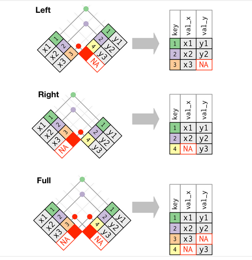
.caption[
From [R for Data Science](https://r4ds.had.co.nz/tidy-data.html)
]
]

]<!---->


.panel[.panel-name[Venn Diagram]

.center[
<br>

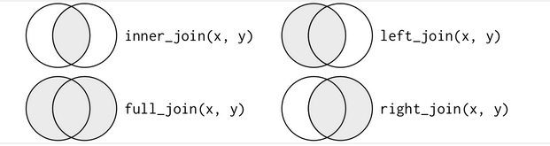
.caption[
From [R for Data Science](https://r4ds.had.co.nz/tidy-data.html)
]
]

]<!---->


]<!--end panelset-->


---

.center[
# Now You Try!
]

.panelset[

.panel[.panel-name[Task]
- I'd like to you to try out the `left_join()`, `right_join()`, and `full_join()` functions with the `x` and `y` tibbles <br> <br>
- Before you run these functions, tell me which values of the key variable and how many `NA` values will be in the resulting merged tibble <br> <br>
- Then, run the functions and see what you get!

.center[

]

]<!---->

.panel[.panel-name[left_join]

```{r eval = FALSE}
x %>% 
  left_join(y, by = "key")
```

```{r echo = FALSE}
x %>% 
  left_join(y, by = "key") %>% 
  knitr::kable()
```

]<!---->

.panel[.panel-name[right_join]
```{r eval = FALSE}
x %>% 
  right_join(y, by = "key")
```

```{r echo = FALSE}
x %>% 
  right_join(y, by = "key") %>% 
  knitr::kable()
```

]<!---->


.panel[.panel-name[full_join]
```{r eval = FALSE}
x %>% 
  full_join(y, by = "key")
```

```{r echo = FALSE}
x %>% 
  full_join(y, by = "key") %>% 
  knitr::kable()
```

]<!---->

]<!--end panelset-->


---

.center[
# Duplicate Keys
]

.panelset[

.panel[.panel-name[Overview]

- Duplicate keys arise when the values in the key column in one or more tables are not unique <br> <br>
- Two scenarios
   - One table has duplicate keys
      - One-to-many
   - Both tables have duplicate keys
      - Most likely an error


]<!---->

.panel[.panel-name[One Table]

.pull-left[

.pull-left[
```{r eval = FALSE}
x <- tribble(
  ~key, ~val_x,
     1, "x1",
     2, "x2",
     2, "x3",
     1, "x4")
```
]

.pull-right[

```{r eval = FALSE}
y <- tribble(
  ~key, ~val_y,
     1, "y1",
     2, "y2")
```

]

.center[
```{r eval = FALSE}
left_join(x, y, by = "key")
```
]

]

.pull-right[

```{r echo = FALSE}
x <- tribble(
  ~key, ~val_x,
     1, "x1",
     2, "x2",
     2, "x3",
     1, "x4")
y <- tribble(
  ~key, ~val_y,
     1, "y1",
     2, "y2")
left_join(x, y, by = "key")
```

.left[
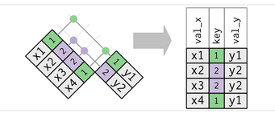
]

]
]<!---->

.panel[.panel-name[Both Tables]

.pull-left[

.pull-left[
```{r eval = FALSE}
x <- tribble(
  ~key, ~val_x,
     1, "x1",
     2, "x2",
     2, "x3",
     3, "x4")
```

]
.pull-right[
```{r eval = FALSE}
y <- tribble(
  ~key, ~val_y,
     1, "y1",
     2, "y2",
     2, "y3",
     3, "y4")
```
]

.center[
```{r eval = FALSE}
left_join(x, y, by = "key")
```

]
]

.pull-right[

.pull-left[
```{r echo = FALSE}
x <- tribble(
  ~key, ~val_x,
     1, "x1",
     2, "x2",
     2, "x3",
     3, "x4"
)
y <- tribble(
  ~key, ~val_y,
     1, "y1",
     2, "y2",
     2, "y3",
     3, "y4"
)
left_join(x, y, by = "key")
```
]

.pull-right[
<br>
<br>
<br>
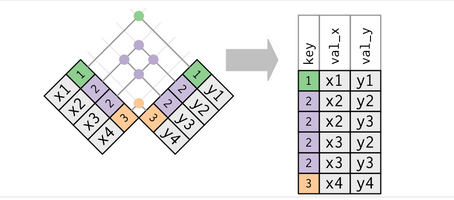
]
]
]<!---->


]<!--end panelset-->


---

.center[
# Defining Key Columns
]
.panelset[

.panel[.panel-name[Default]

- The specification of the key variables in our `*_join()` statements can be more complex than we've used so far
   - By default, `by = NULL` uses all variables that appear in both tables (a natural join)

```{r}
flights2 %>% left_join(weather) %>% head(3) %>% select(1:13) %>% head(3) %>% knitr::kable("html")
```

]<!---->

.panel[.panel-name[by = "x"]

- We can also supply a character vector in common to both tables
- Note that the year variables are disambiguated in the output with a suffix

```{r}
flights2 %>% left_join(planes, by = "tailnum") %>% head(3) %>% select(1:10) %>% head(3) %>% knitr::kable("html")
```


]<!---->

.panel[.panel-name[by = c("a" = "b")]

- If the key variables have different names in the two tables, use `by = c("a" = "b")`
   - Will match variable `a` in table `x` to variable `b` in table `y`

```{r}
flights2 %>% left_join(airports, c("dest" = "faa")) %>% head(n = 3) %>% select(1:10) %>% head(3) %>% knitr::kable("html")
```

]<!---->

]<!--end panelset-->


---
class: inverse, center, middle


# Filtering Joins!
----
`r icons::icon_style(icons::fontawesome("r-project"), scale = 3, fill = "white")`


---

.center[
# Filtering Joins
]
<br>
- Filtering joins match observations in the same was as mutating joins <br> <br>
- But filtering joins affect the observations, not the variables <br> <br>
- There are two types:
   - `semi_join(x, y)`:  Keeps all observations in `x` that have a match in `y`
   - `anti_join(x, y)`:  Drops all observations in `x` that have a match in `y`

---

.center[
# semi_join()
]

- Semi-joins are useful for matching filtered summary tables back to the original rows

.pull-left[
```{r}
top_dest <- flights %>% count(dest, sort = TRUE) %>% head(5)
top_dest
```
]

.pull-right[
```{r}
flights %>% semi_join(top_dest)
```
]

---

.center[
# semi_join
]

.pull-left[

- Figures to the right present a graphical depiction of a `semi_join()` <br> <br>
- Filter joins just search for matches across tables
   - Doesn't matter which observations match
   - Filtering joins never duplicate rows like mutating joins do <br> <br>
- Filtering joins will not add any new columns to `x`

]

.pull-right[
.center[
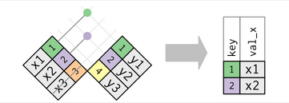
]

<br>

.center[
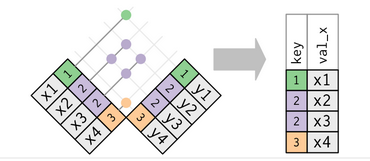
]
]


---

.center[
# anti_join
]

- Used less frequently than `semi_join()` <br> <br>
- Useful for diagnosing join mismatches

<br>
.center[
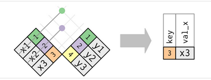
]


---

.center[
# anti_join
]

```{r}
flights %>% anti_join(planes, by = "tailnum") %>% count(tailnum, sort = TRUE)
```


---

.center[
# Now You Try!
]

<br>

- Create a smaller flights dataset containing only the five days with the highest average departure delay

---


.center[
# Solution
]

```{r warning = FALSE, message = FALSE}
long_delay5 <- flights %>% group_by(year, month, day) %>% summarize(mean = mean(dep_delay, na.rm = TRUE)) %>% ungroup() %>% slice_max(order_by = mean, n = 5)
```

```{r}
flights %>% semi_join(long_delay5)
```

