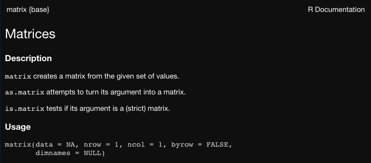

```{r xaringan-themer, include=FALSE, warning=FALSE}
require(xaringanthemer)
require(xaringanExtra)
require(magrittr)
require(knitr)
require(beepr)
style_duo(primary_color = "#e3e3e2", 
          secondary_color = "#8a2377",
          code_inline_color = "#7f6a8f",
          text_font_size = "1.1rem",
          header_font_google = google_font("Lato"),
          text_font_google   = google_font("Lora"),
          code_font_google   = google_font("Space Mono")
          )
```

```{r xaringan-panelset, echo=FALSE}
xaringanExtra::use_panelset()
xaringanExtra::use_tile_view()
xaringanExtra::use_clipboard()
xaringanExtra::use_scribble()
xaringanExtra::use_search(show_icon = FALSE)
xaringanExtra::use_extra_styles(
  hover_code_line = TRUE,         #<<
  mute_unhighlighted_code = TRUE  #<<
)
```

class: title-slide, right, top
background-image: url(img/axsome_logo.png)
background-size: 40%, cover

```{r xaringan-logo, echo=FALSE}
xaringanExtra::use_logo(
  image_url = "img/axsome_logo.png",
  position = xaringanExtra::css_position(top = ".5em", right = ".5em"),
  height = "130px",
  width = "150px",
  exclude_class = c("title-slide", "inverse", "hide_logo")
)
```


.right-column[
# `r rmarkdown::metadata$title`
### `r rmarkdown::metadata$subtitle`

**`r rmarkdown::metadata$author`**<br>
`r rmarkdown::metadata$institute`<br>
`r rmarkdown::metadata$date`
]

---
class: inverse center middle

# It's Just a Fancy Calculator
----
`r icons::icon_style(icons::fontawesome("r-project"), scale = 3, fill = "white")`

---

.center[
# Simple Arithmetic
]

.pull-left[
- Performing arithmetic is simple and straight-forward in R
- R can easily handle addition, subtraction, multiplication and division
  - `+`
  - `-`
  - `*`
  - `/`
- Exponents are also easy to implement using ` ^ ` or `sqrt()`
- R can also perform matrix algebra and some calculus, but we won't focus on that
]

.pull-right[
```{r}
2 + 2
```

```{r}
2 * 2
```

```{r}
2^2
```

```{r}
sqrt(2)
```

]

---

.center[
# Storing Objects
]

.pull-left[
- In order to call up a result in the future, we must store it as an object
- Objects are created using the assignment operator: `<-`
  - `=` can also create stored objects through assignment, but I prefer to reserve `=` for more specific applications
- Once an object has been created, it will be stored in the environment and is able to be called up later or further manipulated
]

.pull-right[
```{r}
x <- 2 + 2
```

```{r}
x
```

<br>
.center[]
]


---

.center[
# Storing More Complex Objects
]

.pull-left[
- Objects can store more complex information than just single numeric values
- For example, we can store a **vector** of numeric values as an object
  - As before the key is to use the ` <- ` operator
  - But now we'll add the `c` function
    - `c` stands for concatenate and tells R to combine the values into a vector
    - We'll use `c` and ` <- ` A LOT, so make sure to remember them! `r emo::ji("star")`
- In the example to the right, we created a vector consisting of 1, 2, 3, 4, and 5
- We can use the `:` operator as a shortcut, which will inclusively produce all integers between the two specified values
]

.pull-right[
```{r}
y <- c(1, 2, 3, 4, 5)
y
```

```{r error = TRUE}
a <- 1, 2, 3, 4, 5
```

```{r}
z <- 1:5
z
```

]

---

.center[

# Arithmetic with Vectors
]

.pull-left[
- You can also perform arithmetic using vectors
- **Element-Wise Execution**: application of an operation to each corresponding element in the set; will return an object (e.g., vector, matrix, etc.) of the same dimensions as the original objects
  - lines up the vectors and performs a sequence of individual operations
]

.pull-right[
```{r}
y
z
y * z
```
]

--

.pull-left[
- **Vector Recycling**: If one object is smaller than the other, it will recycle the smaller object until it is as long as the longer vector
]

.pull-right[
```{r}
x * z
```
]

---
.center[
# Arithmetic Functions
]

.pull-left[
```{r echo = FALSE}
data.frame(
  Function = c("mean", "median", "sd", "var", "max", "min", "log", "exp", "round", "cor"),
  Operation = c("Mean", "Median", "Standard Deviation", "Variance", "Largest Element", "Smallest Element", "Natural Log", "Exponential", "Round to n Decimal Places", "Correlation")) %>% 
  kable(format = "html") %>% 
  kableExtra::column_spec(1:2, background = "white")
```
]

.pull-right[
```{r}
mean(y)
```

```{r}
min(y)
```

```{r}
var(y)
```

```{r}
round(var(y), digits = 0)
```

]

---
.center[
# Anatomy of a Function
]

.pull-left[
- **Functions** perform actions on objects
- To use a function, write the name of the function and then the object you want the function to operate on in parentheses
  - e.g., `round(y)`
- All the stuff contained within the parentheses are the **arguments** of the function
- Typically, the first argument of a function is the object the function should operate on (often referred to as the data)
- But functions can have many arguments, like the `digits` argument we saw earlier
- For arithmetic functions, missing data arguments are important! `r emo::ji("star")`
]

.pull.right[
```{r}
x_miss = c(1, 2, NA, 4, 5)
x_miss
```

```{r}
mean(x_miss)
```

```{r}
mean(x_miss, na.rm = TRUE)
```

]

---
.center[
# What Have We Covered So Far?
]

.pull-left[
- R can perform basic arithmetic
<br> <br>
- We can create vectors of numbers
<br> <br>
- We can use element-wise execution to perform arithmetic on multiple vectors
<br> <br>
- We can use base R functions to perform computations
<br> <br>
- Functions have arguments that we specify
<br> <br>
- Be wary of missing data!
]

.pull-right[
.center[
<br>


<figcaption> Photo by Markus Winkler </figcaption>
]
]

---
.center[
# Let's Try an Exercise!
]

.pull-left[
1. Create a vector of values 4, 8, 2, 4, 9 and store it as an object "a"
<br> <br>
1. Create a second vector of values 7, 4, 5, 9, 2, and store is as object "b"
<br> <br>
1. Multiply a and b and store it as object "d"
<br> <br>
1. Find the mean of d
<br> <br>
1. Find the variance of d
<br> <br>
1. Round the variance of d to 0 decimal places
<br> <br>
]

.pull-right[
`r countdown::countdown(minutes = 2, seconds = 30, play_sound = TRUE, font_size = "5em", margin = "22% 9%", color_running_background = "#e3e3e2", color_running_text = "#a6873b", color_finished_background = "#a6873b", color_finished_text = "#e3e3e2")`
]


---
.center[
# Solution
]

.pull-left[
```{r}
a <- c(4, 8, 2, 4, 9)
a
```

```{r}
b <- c(7, 4, 5, 9, 2)
b
```

```{r}
d <- a * b
d
```

]

.pull-right[
```{r}
mean(d)
```

```{r}
var(d)
```

```{r}
round(var(d), digits = 0)
```
]

---
class: inverse middle center

# A Brief Interruption to Our Regularly Scheduled Programming
----
`r icons::icon_style(icons::fontawesome("tv"), scale = 3, fill = "white")`


---

.center[
# Help!
]

.left-column[
.center[
<br>
<br>
<br>
<br>

.caption[
Via [Giphy](https://media.giphy.com/media/fdLR6LGwAiVNhGQNvf/giphy.gif)
]
]
]

.right-column[
- To learn more about a function, use help documentation
  - `?function`
  - `help(function)`
- Help documentation consists of the following sections:
  - *Description*: A short summary of the what the function does
  - *Usage*: An example of how you would use the function
  - *Arguments*: A list of each agument the function takes
  - *Detail*: A more in-depth description of the fucntion and how it operates
  - *Value*: A description of what the function returns when you run it
  - *Examples*: Additional examples of the function in use
- [CRAN documents](https://CRAN.R-project.org/package=gt) provide package-wide reference manuals, vignettes/tutorials, Github repos, and BugReports
- When in doubt, [Stack Overflow](https://stackoverflow.com/)
]


---
.center[
# Programming Miscellany
]

.pull-left[
1. R is **case sensitive**
  - e.g., `mean` does not equal `Mean`
<br>
<br>
1. Objects/variable names cannot begin with numbers and cannot include some special characters
  - i.e., ^, !, $, @, +, -, /, or *
<br>
<br>
1. Use `#` to comment code
  - Will not evaluate anything written after `#`
<br>
<br>
1. Spaces are not allowed
  - Use `_` instead
]

.pull-right[
```{r error = TRUE}
Mean(c(1, 2, 3))
```

<br>
<br>
<br>
```{r}
# mean(c(1, 2, 3))
```
<br>
```{r error = TRUE}
x miss
```

]

---
.center[
# Debugging
]

.panelset[
.panel[.panel-name[Debugging Messages]
- <span style = 'color: red; font-weight: bold;'>Errors</span>: Text will begin with "*Error in...*" and include a description of the error
  -  Your code will not work
  - These messages cannot be ignored
- <span style = 'color: yellow; font-weight: bold;' >Warnings</span>: Text will begin with "*Warning:*" and followed by an explanation of the cause of the warning
  - Your code will probably still work, but there may be issues
  - Evaluate the warning and determine whether changes are necessary
- <span style = 'color: green; font-weight: bold;' >Messages</span>: Text will not begin with "*Error in...*" or "*Warning:*"
  - These are helpful diagnostics and will not stop your code from running
] <!---->

.panel[.panel-name[Error Example]

```{r error = TRUE}
f <- c(1, 2, 3, 4, 5)
Mean(f)
```


```{r error = TRUE}
ggplot(mtcars, aes(x = disp, y = mpg)) + 
  geom_point()
```

] <!---->

.panel[.panel-name[Warning Example]

.pull-left[

```{r echo = FALSE, message = FALSE, warning = FALSE}
require(ggplot2)
```

```{r plot-right1, fig.show = 'hide'}
ggplot(airquality, aes(x = Ozone, y = Temp)) + 
  geom_point()
```
]

.pull-right[
```{r ref.label = 'plot-right1', echo = FALSE, fig.width = 7, fig.height = 7 * .619, warning = FALSE, message = FALSE}
```

]
] <!---->

.panel[.panel-name[Message Example]
.pull-left[

```{r echo = FALSE}
detach("package:ggplot2", unload=TRUE)
```


```{r plot-right2, fig.show = 'hide'}
require(ggplot2)
ggplot(mtcars, aes(x = disp, y = mpg)) + 
  geom_point()
```
]

.pull-right[
```{r ref.label = 'plot-right2', echo = FALSE, fig.width = 7, fig.height = 7 * .619}
```

]

] <!---->


] <!--end of panelset-->

---

class: center middle hide_logo
background-image: url(img/mod2/quiz.jpg)
background-size: cover


<span style = 'color: red; font-weight: bold; font-size: 120px'>Pop Quiz!</span> 


---

.center[
# Calculating Correlations
]

.pull-left[
1. Create a vector of values 42, 75, 38, NA, 10, 120, 32 and name it "a" 

1. Create a second vector of values 504, NA, 690, 200, 250, NA, 400 and name it "b"

1. Calculate the Spearman rank correlation of vector "a" and vector "b"
  - Hint:  Use the `cor` function
`r countdown::countdown(minutes = 3, seconds = 00, play_sound = TRUE, font_size = "3em", margin = "8% 68%", color_running_background = "#e3e3e2", color_running_text = "#a6873b", color_finished_background = "#a6873b", color_finished_text = "#e3e3e2")`
]

--

.pull-right[
```{r}
a <- c(42, 75, 38, NA, 10, 120, 32)
b <- c(504, NA, 690, 200, 250, NA, 400)
cor(a, b, use = "complete.obs", method = "spearman")
```

]


---
class: inverse center middle

# R Objects:  More Than Just (Atomic) Vectors
----
`r icons::icon_style(icons::fontawesome("r-project"), scale = 3, fill = "white")`


---
.center[
# Atomic Vectors
]

.left-column[
.center[
<br>
<br>
<br>

.caption[
Via [Giphy](https://media.giphy.com/media/tAPkUnA2GQNVK/giphy.gif)
]
]
]

.right-column[
- **Atomic Vector** - a simple vector of data
  - One-dimensional
  - All elements must be of the same type
  - Basis of most data structures in R
  - R recognizes six types of atomic vectors
     1. **Doubles** - stores regular numbers, can include decimals
     1. **Integers** - stores whole numbers
     1. **Characters** - stores small pieces of text ("strings")
     1. **Logicals** - stores TRUEs and FALSEs
     1. **Complex** - stores complex numbers (e..g, imaginary numbers)
     1. **Raw** -  stores raw bytes of data
- You can check the type of a vector using the `typeof` or `is.*` functions
          
]


---

.center[
# Double Atomic Vectors
]

.pull-left[
- Stores regular numbers <br> <br>
- Can have digits to the right of the decimal place or not <br> <br>
- Default type for numbers in R <br> <br>
- Sometimes referred to as a "numeric" in R <br> <br>
- Numbers are stored to 16 significant digits
]

.pull-left[
```{r}
x_type <- c(1, 2, 3, 4, 5)
typeof(x_type)
```

```{r}
is.numeric(x_type)
```

```{r}
sqrt(2)^2 - 2
```

]


---

.center[
# Integer Atomic Vectors
]

.pull-left[
- Stores whole numbers <br> <br>
- Cannot have digits to the right of the decimal place <br> <br>
- Needs to be specified in R using an `L` after a number <br> <br>
- More precise than doubles <br> <br>
]

.pull-left[
```{r}
x_type <- c(1L, 2L, 3L, 4L, 5L)
typeof(x_type)
```

```{r}
is.integer(x_type)
```

]


---

.center[
# Character Atomic Vectors
]

.pull-left[
- Stores text strings <br> <br>
- Need to surround text with `""` in order to combine it into a vector <br> <br>
- Text can be letters, special symbols, or numbers <br> <br>
- Anything surrounded by quotes will be treated by R as a character string <br> <br>
]

.pull-left[
```{r}
x_type <- c("You", "Are", "Number", "1", "!")
x_type
typeof(x_type)
```

```{r}
is.character(x_type)
```

]


---

.center[
# Logical Atomic Vectors
]

.pull-left[
- Stores TRUE and FALSE values <br> <br>
- Important for logical and Boolean operators
  - e.g., a > b & a > c <br> <br>
- R will interpret TRUE, FALSE, T, or F as logical data
  - Note the absence of quotations!
]

.pull-left[
```{r}
x_type <- c(TRUE, T, FALSE, F)
x_type
typeof(x_type)
```

```{r}
is.logical(x_type)
```

]


---
.center[
# `r emo::ji("flex")`   Coercion  `r emo::ji("flex")`
]


.panelset[
.panel[.panel-name[Coercion Background]
.pull-left[
- **Coercion** - Conversion of data type when conflicting types are present
  - e.g., double and character string
- R follows a consistent set of rules for coercion
  1.  character and double/integer/logical --> character
  1.  double and integer --> double  
  1.  double and logical --> double
  1.  integer and logical --> integer
     - TRUE = 1, FALSE = 0
- Coercion rules retain information
]

.pull-right[

.caption[
Figure from [Hands-On Programming with R](https://rstudio-education.github.io/hopr/)
]
]

] <!---->

.panel[.panel-name[Coercion In Action]

.pull-left[
```{r}
typeof(c("Hello", 1, 4, 8))
```

```{r}
c("Hello", 1, 4, 8)
```

]

.pull-right[
```{r}
typeof(c(TRUE, 1, 5, FALSE))
```

```{r}
c(TRUE, 1, 5, FALSE)
```

```{r}
sum(c(TRUE, FALSE, FALSE, TRUE))
```


]

] <!---->
] <!--end of panelset-->

---

.center[
# Beyond Atomic Vectors:  Matrices!
]

.pull-left[
- Matrices store values in a two-dimensional array
  - like in linear algebra
- Can only store a single type of information (e.g., doubles)
- Use the `matrix` function to create a matrix
<br>

.center[

.caption[ `matrix` Help Documentation]
]
]

.pull-right[
```{r}
m <- matrix(c(1, 2, 3, 4, 5, 6), 
         nrow = 2,
         ncol = 3, 
         byrow = TRUE)
m
```

]


---

.center[
# Beyond Atomic Vectors: Factors!
]

.pull-left[
- Factors store categorical information 
  - e.g., ethnicity, sex, etc.
- R stores factors as integers
  - Makes them good for using in models
  - But confusing...
      - Looks like a character string
      - But behaves like an integer
- To create a factor, use the `factor` function
- Factors also have a levels attribute
  - This can be specificied using the `levels` argument in the `factor` function
]

.pull-right[
```{r}
f <- factor(c("ACT", "PBO", "PBO", "ACT"))
f
```

```{r}
f <- factor(c("ACT", "PBO", "PBO", "ACT"),
            levels = c("ACT", "PBO"))
f
```

]

---

.center[
# Beyond Atomic Vectors: Lists!
]

.pull-left[
- Lists group together R objects, such as atomic vectors
- Lists can be comprised of many different data types
  - e.g., double vectors, character vectors, other lists
- Use the `list` function to create a list
- Lists are very important in R but can get complicated quickly
- We won't use lists much in this course, except...
]

.pull-right[
```{r}
list(1:5, c("Here", "I", "Am"), c(T, T, F))
```

]


---

.center[
# Beyond Atomic Vectors: Dataframes!
]

.panelset[
.panel[.panel-name[Data Frames Background]
.pull-left[
- Data frames are the two-dimensional version of a list
- Vectors are columns in a data frame
- Because data frames are lists, the columns (vectors) can be of different types
- However, the cells (elements) within a column (vector) must all be of the same type
- Data frames are the most common type of data object in R and we'll use them A LOT over the coming weeks
]

.pull-right[
.center[Air Quality Data Frame]
```{r echo = FALSE}
head(airquality)
```
]

] <!---->

.panel[.panel-name[Data Frames In Action]
.pull-left[
- Use `data.frame` to create your own data frame
- Note that data frames are lists
```{r}
dat <- data.frame(
  x = c(1, 2, 3),
  y = c(TRUE, FALSE, FALSE),
  z = c("Bob", "Phil", "Jerry")
)
typeof(dat)
```
]

.pull-right[
- Data frames can contain different types of data in columns
- To see the type of data of each column use the `str` (short for structure) function
```{r}
str(dat)
```

]

] <!---->

] <!--end of panelset-->

---

.center[
# One More Time, Please!
]

.pull-left[
- Data can be stored in **atomic vectors**
<br> <br>
- There are four main types of atomic vectors: **double, integer, character, and logical**
<br> <br>
- Conflicting data types are **coerced** following a consistent set of rules
<br> <br>
- **Factors** are well-suited for handling categorical data
<br> <br>
- **Lists** allow for different data types to co-exist
<br> <br>
- **Data Frames** are two-dimensional lists that are used frequently in data analysis
]

.pull-right[
.center[
<br>
<br>


<figcaption> Photo by Markus Winkler </figcaption>
]
]


---
class: bottom right hide_logo
background-image: url(img/mod2/vw.jpg)
background-size: cover

.left[.footnote[Photograph by [Tommy Lisbin](https://unsplash.com/photos/xr-y6Ruw7K8)]]

# Off to the Tidyverse...

