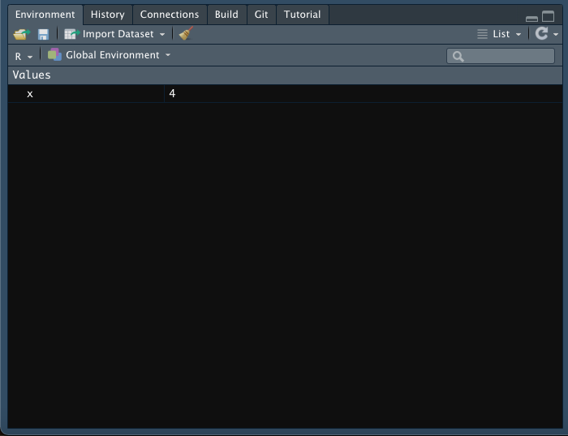

```{r xaringan-themer, include=FALSE, warning=FALSE}
require(xaringanthemer)
require(xaringanExtra)
style_duo(primary_color = "#e3e3e2", 
          secondary_color = "#a6873b",
          code_inline_color = "#746850",
          text_font_size = "1.1rem",
          header_font_google = google_font("Lato"),
          text_font_google   = google_font("Lora"),
          code_font_google   = google_font("Space Mono")
          )
```

```{r xaringan-panelset, echo=FALSE}
xaringanExtra::use_panelset()
xaringanExtra::use_tile_view()
xaringanExtra::use_clipboard()
xaringanExtra::use_scribble()
xaringanExtra::use_search(show_icon = FALSE)
xaringanExtra::use_extra_styles(
  hover_code_line = TRUE,         #<<
  mute_unhighlighted_code = TRUE  #<<
)
```

class: title-slide, right, top
background-image: url(img/canopy_logo.png)
background-size: 50%, cover

```{r xaringan-logo, echo=FALSE}
xaringanExtra::use_logo(
  image_url = "img/canopy_logo.png",
  position = xaringanExtra::css_position(top = ".5em", right = ".5em"),
  height = "140px",
  width = "160px",
  exclude_class = c("title-slide", "inverse", "hide_logo")
)
```


.right-column[
# `r rmarkdown::metadata$title`
### `r rmarkdown::metadata$subtitle`

**`r rmarkdown::metadata$author`**<br>
`r rmarkdown::metadata$institute`<br>
`r rmarkdown::metadata$date`
]

---
class: inverse center middle

# It's Just a Fancy Calculator
----
`r icons::icon_style(icons::fontawesome("r-project"), scale = 3, fill = "white")`

---

.center[
# Simple Arithmetic
]

.pull-left[
- Performing arithmetic is simple and straight-forward in R
- R can easily handle addition, subtraction, multiplication and division
  - `+`
  - `-`
  - `*`
  - `/`
- R can also perform matrix algebra and some calculus, but we won't focus on that
]

.pull-right[
```{r}
2 + 2
```

```{r}
2 - 2
```

```{r}
2 * 2
```

```{r}
2 / 2
```

]

---

.center[
# Storing Objects
]

.pull-left[
- In order to call up a result in the future, we must store it as an object
- Objects are created using the assignment operator: `<-`
  - `=` can also create stored objects through assignment, but I prefer to reserve `=` for more specific applications
- Once an object has been created, it will be stored in the environment and is able to be called up later or further manipulated
]

.pull-right[
```{r}
x <- 2 + 2
```

```{r}
x
```

<br>
.center[]
]


---

.center[
# Storing More Complex Objects
]

.pull-left[
- Objects can store more complex information than just single numeric values
- For example, we can store a **vector** of numeric values as an object
  - As before the key is to use the ` <- ` operator
  - But now we'll add the `c` function
    - `c` stands for concatenate and tells R to combine the values into a vector
    - We'll use `c` and ` <- ` A LOT, so make sure to remember them! `r emo::ji("star")`
- In the example to the right, we created a vector consisting of 1, 2, 3, 4, and 5
- We can use the `:` operator as a shortcut, which will inclusively produce all integers between the two specified values
]

.pull-right[
```{r}
y <- c(1, 2, 3, 4, 5)
y
```

```{r error = TRUE}
a <- 1, 2, 3, 4, 5
```

```{r}
z <- 1:5
z
```

]

---