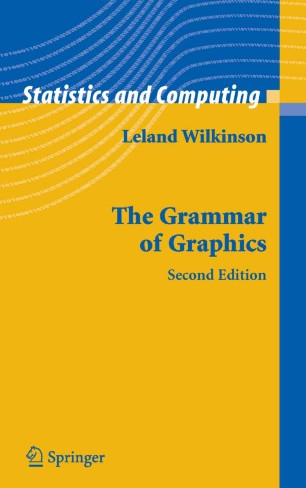

```{r xaringan-themer, include=FALSE, warning=FALSE}
require(xaringanthemer)
require(xaringanExtra)
require(icons)
style_duo(primary_color = "#e3e3e2", 
          secondary_color = "#a6873b",
          code_inline_color = "#746850",
          text_font_size = "1.1rem",
          header_font_google = google_font("Lato"),
          text_font_google   = google_font("Lora"),
          code_font_google   = google_font("Space Mono")
          )
```

```{r xaringan-panelset, echo=FALSE}
xaringanExtra::use_panelset()
xaringanExtra::use_tile_view()
xaringanExtra::use_clipboard()
xaringanExtra::use_scribble()
xaringanExtra::use_search(show_icon = FALSE)
xaringanExtra::use_extra_styles(
  hover_code_line = TRUE,         #<<
  mute_unhighlighted_code = TRUE  #<<
)
```

class: title-slide, right, top
background-image: url(img/hex_ggplot2.png), url(img/canopy_logo.png)
background-position: 93% 63%, 50% 50%
background-size: 10%, 50%

```{r xaringan-logo, echo=FALSE}
xaringanExtra::use_logo(
  image_url = "img/canopy_logo.png",
  position = xaringanExtra::css_position(top = ".5em", right = ".5em"),
  height = "140px",
  width = "160px",
  exclude_class = c("title-slide", "inverse", "hide_logo")
)
```


.right-column[
# `r rmarkdown::metadata$title`
### `r rmarkdown::metadata$subtitle`

**`r rmarkdown::metadata$author`**<br>
`r rmarkdown::metadata$institute`<br>
`r rmarkdown::metadata$date`
]


---
class: inverse, center, middle


# Graphics Have Grammars?
----
`r icons::icon_style(icons::fontawesome("r-project"), scale = 3, fill = "white")`


---

.center[
# Grammar of Graphics
]

.pull-left[
- Proposed by Leland Wilkinson in 2005
- Attempt to describe the essential features that underlie all statistical graphics
  1. Graph is a mapping of data to aesthetic attributes (color, shape, size) of geometric objects (lines, bars, points)
  1. Graph may contain statistical transformations of the data
  1. Graph is drawn on a specific coordinate system
  1. Facetting can be used to create small mulitiples of graphs
]

.pull-right[
.center[]
]


---

.center[
# Fundamental Components of A Graph
]

.pull-left[
1. **Data**  to visualize and **aesthetic mappings** of how aesthetics are applied to data
1. **Layers** of geometric elements and statistical transformations
  - **geoms** are what you see on the plot (e.g., lines, points, etc.)
  - **stats** summarize data (e.g., group mean)
1. **Scales** map values in data space to values in an aesthetic space
1. **Coord**inates describe how data coordinates are mapped to the plane of the graphic
1. **Facet**ing describes how to break up data into subsets (e.g., small multiples)
1. **Theme** controls finer points of display (e.g., font size, background color, etc.)
]

.pull-right[
<br>
.center[]
]

---
class: inverse, center, middle


# Let's Get Plotting!
----
`r icons::icon_style(icons::fontawesome("chart-line"), scale = 3, fill = "white")`


---

.center[
# First, The Dataset
]

```{r echo = FALSE}
require(tidyverse)
require(DT)
datatable(mpg, 
              rownames = FALSE, 
              caption = "mpg Dataset",
              options = list(
                dom = 'tSp', 
                pageLength = 234,
                scrollY = "300px"))
```


---

.center[
# Create a `ggplot`
]

.pull-left[
- Use `ggplot()` to initialize the plot
  - Creates a coordinate system to add layers to
  - Supply data to the plot using the `data` argument
- You can then add layers of geoms to the plot
- Geoms require aesthetic mappings
  - Use `mapping` argument and `aes` function to specify
```{r plot1, fig.show = 'hide'}
ggplot(data = mpg) + 
  geom_point(mapping = aes(x = displ, y = hwy))
```

]

.pull-right[
```{r ref.label = 'plot1', echo = FALSE, fig.width = 7, fig.height = 7 * .619, warning = FALSE, message = FALSE}
```
]