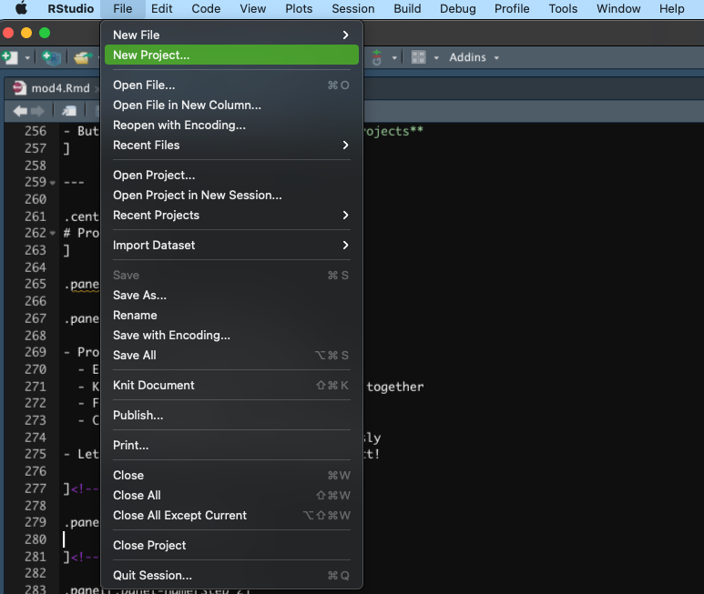
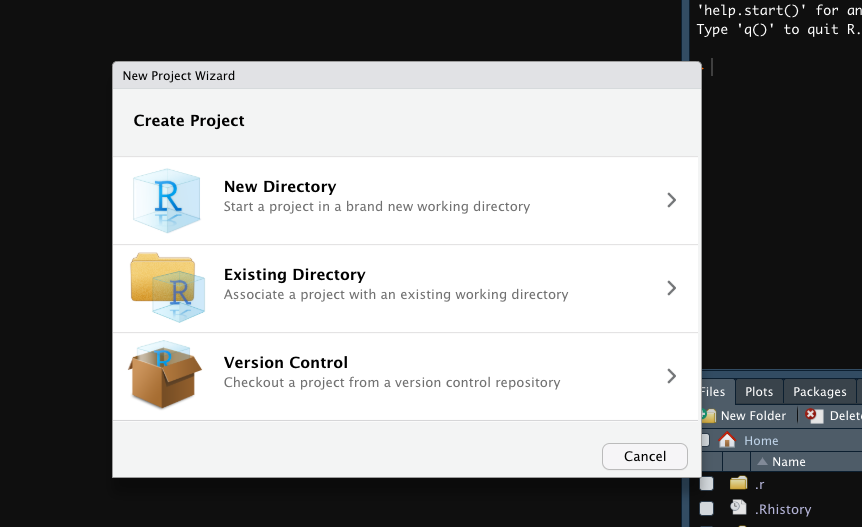
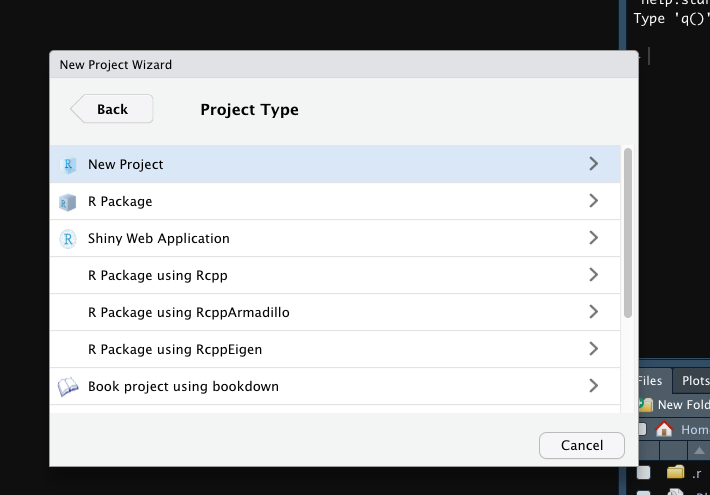
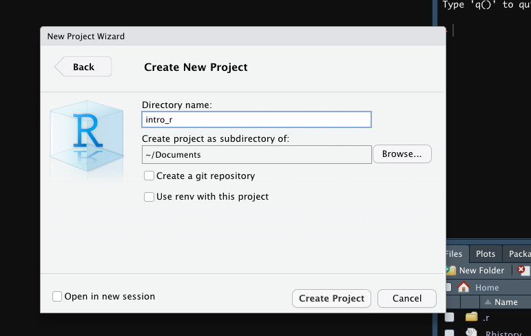
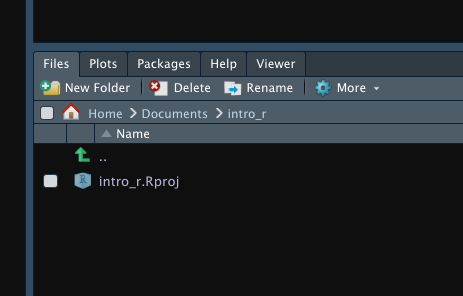

```{r xaringan-themer, include=FALSE, warning=FALSE}
require(xaringanthemer)
require(xaringanExtra)
require(icons)
style_duo(primary_color = "#e3e3e2", 
          secondary_color = "#a6873b",
          code_inline_color = "#746850",
          text_font_size = "1.1rem",
          header_font_google = google_font("Lato"),
          text_font_google   = google_font("Lora"),
          code_font_google   = google_font("Space Mono")
          )
```

```{r xaringan-panelset, echo=FALSE}
xaringanExtra::use_panelset()
xaringanExtra::use_tile_view()
xaringanExtra::use_clipboard()
xaringanExtra::use_scribble()
xaringanExtra::use_search(show_icon = FALSE)
xaringanExtra::use_extra_styles(
  hover_code_line = TRUE,         #<<
  mute_unhighlighted_code = TRUE  #<<
)
```

class: title-slide, right, top
background-image: url(img/canopy_logo.png)
background-position: 50% 50%
background-size: 50%

```{r xaringan-logo, echo=FALSE}
xaringanExtra::use_logo(
  image_url = "img/canopy_logo.png",
  position = xaringanExtra::css_position(top = ".5em", right = ".5em"),
  height = "140px",
  width = "160px",
  exclude_class = c("title-slide", "inverse", "hide_logo")
)
```


.right-column[
# `r rmarkdown::metadata$title`
### `r rmarkdown::metadata$subtitle`

**`r rmarkdown::metadata$author`**<br>
`r rmarkdown::metadata$institute`<br>
`r rmarkdown::metadata$date`
]


---

.center[
# Overview
]

- This module will be different than the rest
- We won't be learning many new functions...
- Instead, we'll be focusing on important but less heralded aspects of R programming


--

- **Style**
  - Using a consistent set of coding conventions to improve reproducibility and readability
- **Workflows**
  - Using projects to bundle data, scripts, results, and figures
- **Directories**
  - Using a consistent scheme of folders to organizes projects
    
---
class: inverse center middle

# Style Guidelines!
----
`r icons::icon_style(icons::fontawesome("r-project"), scale = 3, fill = "white")`


---

.center[
# Style Guidelines
]

- These are my recommendations for writing code, which largely follow [Hadley Wickham's](http://adv-r.had.co.nz/Style.html)

.panelset[

.panel[.panel-name[Object Names]

.pull-left[
- Variable and function names should be lowercase
- Use underscore `_` to separate words within a name
- Variable names should be nouns
  - e.g., "body_mass"
- Functions should be verbs
  - e.g., "plot_model"
]

.pull-right[
- Variable names should be concise and meaningful
- Variables that go together should share prefixes and differ in an informative suffix (or vice-versa)
  - e.g., "bdi_1", "bdi_2", "bdi_3"
- Avoid over-writing existing functions and variables
  - e.g., don't name an object "mean"
]
]<!---->

.panel[.panel-name[Spacing]

.pull-left[
- Place spaces around all infix operators (`=`, `+`, `-`, `<-`, etc.)
- Put spaces after a comma and never before
- Place spaces around `=` in function calls, too
- Place a space before left parentheses, except in a function call
- Extra spacing is ok if it improves alignment of equal signs or assignment
- Do not place spaces around code in parentheses
]

.pull-right[
```{r eval = FALSE}
2 + 2 # Spaces around "+"

cor(x, y) # Spaces after ","

mean(x, na.rm = TRUE) # Spaces around "="

plot(x, y) # No Space between function and left parenthesis

var <- 6
x   <- 4 # Extra spaces used to align assignment

c(x, y) # No Space between code in parenthesis
```
]
]<!---->


.panel[.panel-name[General Syntax]

.pull-left[
- Strive to keep line length to 80 characters
  -  Fits comfortably on a printed page
- When indenting your code, use two spaces. Never use tabs or mix tabs and spaces.
- Align default indentation when using a function over multiple lines
- Use `<-` for assignment, not `=`
]

.pull-right[

<br>
<br>
<br>
```{r eval = FALSE}
penguins %>% 
  mutate(mean_bm = mean(body_mass_g, na.rm = TRUE),
         sd_bm = sd(body_mass_g, na.rm = TRUE))
```

]
]<!---->


.panel[.panel-name[Commenting]

.pull-left[
- Be kind to your future self:  Comment your code!
- Each line of a comment should begin with the comment symbol and a single space
- Comments should explain the why, not the what
- Use commented lines of - to break up your file into easily readable chunks.
]

.pull-right[

<br>
<br>
<br>
```{r}
# Remove row 17 d/t data entry error
```

```{r eval = FALSE}
# Load data ---------------------------

```

]
]<!---->

]<!--end panelset-->


---
class: inverse center middle

# Workflows!
----
`r icons::icon_style(icons::fontawesome("r-project"), scale = 3, fill = "white")`


---

.center[
# What Is Our Analysis?
]

.pull-left[
- Many new R users tend to think of their environment as their "real" analysis
- However, the real analysis product is your R script!
  - Contains all instructions for generating your analysis and output
     - Can easily recreate your environment from your R script
     - Much more difficult to re-create your R script from your environment
  - Can be easily reproduced
  - Can be shared
  ]
  
.pull-right[

.center[

.caption[
Via [Giphy](https://media.giphy.com/media/TgRBXKIOF4tBryPyPa/giphy.gif)
]
]
]

---

.center[
# But *Where* Is Our Analysis?
]

.pull-left[
- **Working Directory**: Where R looks for files that you ask it to load, and where it will put any files that you ask it to save
- Can identify your working directory using the `getwd()` function
- In the past, R users would use the `setwd()` function to specify their working directory from within R
- But now we have a better solution...**Projects**
]

.pull-right[
<br>
.center[

.caption[
Via [Giphy](https://media.giphy.com/media/xUPGcJU55vuGH8Hfeo/giphy.gif)
]
]
]
---

.center[
# Projects!
]

.panelset[

.panel[.panel-name[Background]

- Projects serve multiple functions
  - Establish your working directory
  - Keep all files associated with a task together
  - Facilitate sharing
  - Create independent R environments
     - Can have multiple projects open simultaneously
- Let's walk through creating a new project!

]<!---->

.panel[.panel-name[Step 1]

- First, Click File --> New Project

.center[

]
]<!---->

.panel[.panel-name[Step 2]

- Next, choose "Create New Directory"
- Note:  If you already created a folder for a project before working in R, you can select "Existing Directory"

.center[

]

]<!---->

.panel[.panel-name[Step 3]

- Click on "New Project"

.center[

]


]<!---->


.panel[.panel-name[Step 4]

- Specify the name of the directory (folder) that the project will appear within
- Specify the folder within which the folder you just created will be located

.center[

]


]<!---->


.panel[.panel-name[Check]

- R should open a new session for you
- A new folder will be found in the location you specified in Step 4
- Type `getwd()` in your newly created project and see where your project is located
- Note that you now have a .Rproj file in your "Files" tab in R
  - These files will correspond to what's on your computer
  - We will add more files and sub-directories within this directory

.center[

]

]<!---->


]<!--end panelset-->


---

.center[
# Now You Try!
]


1. Create a new R project
2. Make the Directory name "intro_r" and save it to a convenient location on your computer
3. Make sure you see a .Rproj file in your File tab
4. Check the working directory for your project (`getwd()`) and make sure it corresponds to the directory location you specified


---

.center[
# Paths!
]

- Paths specify the series of directories that lead to a final location
- Relevant for Loading and Saving

.pull-left[
### Absolute Paths
- Paths that point to the same place regardless of your working directory
   - e.g., "/Users/graham.eglit/
         Documents/intro_r/intro_r.Rproj"
- Never use absolute paths
  - Your path will be different from another person's path
     - Inhibits collaboration
]

.pull-right[
### Relative Paths
- Paths that stem from (are relative to) your working directory
- Recall that projects establish a working directory wherever the .Rproj file resides
- Always use relative paths
]


---

.center[
# Paths:  Mac/Linux vs. Windows
]

<br>
Mac/Linux paths differ from Windows in three ways:
   1. Components of paths are separated by forward slashes ("/") in Mac/Linux and by backslashes ("\") in Windows
      - R plays nicely with forward slashes, but misinterprets back slashes
         - Need to either use two back slashes on Windows (e.g., "\\\") or **use Linux/Mac style** <br> <br>
   1.  Absolute paths start from a forward slash in Mac/Linux (e.g., "/users/graham.eglit") vs. a drive letter (e.g., "C:") or two back slashes ("\\\") in Windows <br> <br>
   1.  `~` points to your home directory on Mac/Linux.  Windows doesn't have a notion of a home directory, so `~` points to your documents directory.


---

.center[
# Now You Try!
]

Run the following code and see what happens:

```{r eval = FALSE}
require(tidyverse)

ggplot(diamonds, aes(x = carat, y = price)) + 
  geom_hex()

ggsave("diamonds.pdf")

write_csv(diamonds, "diamonds.csv")
```

--

Note how R saves files to your working directory when using projects!

--

<br>

.center[OK, now delete all the stuff you just created]


---

.center[
# Now You Try!
]

- Now I want you to create a sub-directory structure that we'll use throughout the rest of the course
- Sub-directories are a somewhat advanced topic, so this may take some time getting used to
- But it's a good habit to develop early on!

### Sub-Directory Template
- data
- output
  - mod01
  - mod02
  - mod03, etc.
- scripts
  - mod01
  - mod02
  - mod03, etc.
  

---

.center[
# Now You Try!
]

Now run the following code and see what happens:

```{r eval = FALSE}
ggplot(diamonds, aes(x = carat, y = price)) + 
  geom_hex()

ggsave(filename = "diamonds.pdf", path = "output/mod05")

write_csv(diamonds, filename = "data/diamonds.csv")
```

--

- Note that all paths take off from the working directory <br>
- Also, note that `ggsave` has an explicit "path" argument while `write_csv` prefers you specify the relative path as part of the filename
   - We could do the same thing in `ggsave` as well (e.g., filename = "output/mod5/diamonds.pdf")

--

<br>
.center[Let's keep those files now that they're in the right place!]


---
class: inverse center middle

# Bonus Topic:  File Names!
----
`r icons::icon_style(icons::fontawesome("r-project"), scale = 3, fill = "white")`


---

.center[
# Six Principles of File Naming
]

.pull-left[
1. Be concise and meaningful
2. No spaces
3. Use letters, numbers, hyphens, and underscores...and nothing else
4. Use "-" to separate words that are part of the same chunk
5. Use "_" to separate different chunks
6. Make file names easy to sort
   - Dates
      - Specified as YYYY-MM-DD
      - Should precede descriptions
  - Numbers
     - Use numbers as a prefix to order files
     - Left pad with "0" so all numbers have the same length
]

--

.pull-right[
**Good Names** <br>
2022-04-04_descriptive-statistics.R <br>
2022-04-05_descriptive-statistics-update.R <br>
<br>
01_abstract.docx <br>
02_introduction.docx <br>
... <br>
12_finally-done-with-this-manuscript.docx <br> <br>

**Bad Names** <br>
01-22-2012-working-paper.docx <br>
abstract_+_intro.docx
]

---

.center[
# Recap
]

.pull-left[
<br>
1. Coding style
1. R Scripts
1. R Projects
1. Working Directories and Sub-directories
   - Relative Paths
1. File Naming
]

.pull-right[
<br>

.center[

.caption[
Via [Giphy](https://media.giphy.com/media/sW6P26sp3HFvy/giphy.gif)
]
]
]
