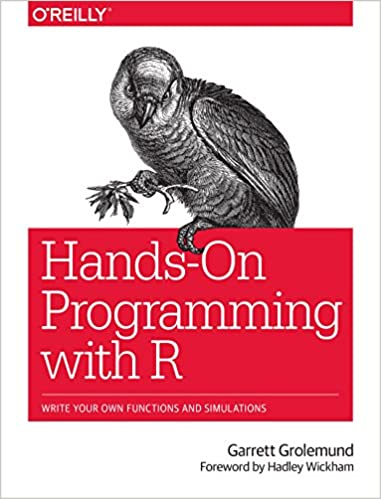
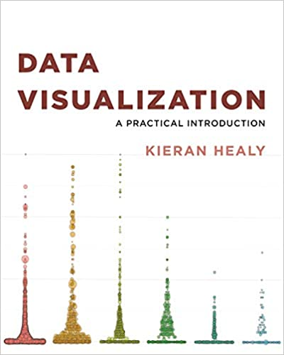
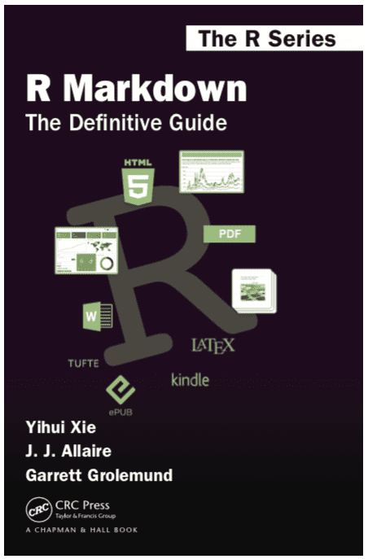

# Books

Below are listed what are in my opinion the best books on R programming.  All of these are freely available online and can be accessed by clicking on the book images below.  In addition to these books, the [Big Book of R](https://www.bigbookofr.com/index.html){target="_blank"} is a large repository of just about every book focused on R.  At the time of this writing, there are over 250 books listed in this repository, which span a wide range of topics (r programming, shiny app development, statistics, machine learning, sports analytics, etc.).

### R Programming

[{width=17.5%}](https://r4ds.had.co.nz/){target="_blank"} 
 
This book is widely considered essential for learning R and will serve as our primary text.

[{width=17.5%}](https://rstudio-education.github.io/hopr/){target="_blank"} 
 
Good supplemental resource for base R

### Data Visualization

[{width=17.5%}](https://ggplot2-book.org/){target="_blank"} 
 
Great overview of the ggplot2 package

[{width=17.5%}](https://socviz.co/){target="_blank"} 
 
Good resource for data visualization with a focus on concrete applications

### R Markdown

[{width=17.5%}](https://bookdown.org/yihui/rmarkdown/){target="_blank"} 
 
The most comprehensive guide to R Markdown
 

[{width=17.5%}](https://bookdown.org/yihui/rmarkdown-cookbook/){target="_blank"} 
 
Great guide to R Markdown with specific strategies and use cases

# Websites

-   [R Studio Education](https://education.rstudio.com/learn/beginner/){target="_blank"}

-   [R Bloggers](https://www.r-bloggers.com/){target="\"_blank"}

# Community

- [R4DS Online Learning Community](https://www.rfordatasci.com/){target="_blank"}

- [R User Groups](https://jumpingrivers.github.io/meetingsR/r-user-groups.html){target="_blank"}

- [R Ladies Groups](https://jumpingrivers.github.io/meetingsR/r-ladies-groups.html){target="_blank"}

- [R Conferences](https://jumpingrivers.github.io/meetingsR/events.html){target="_blank"}

- [Tidy Tuesday](https://github.com/rfordatascience/tidytuesday){target="_blank"}