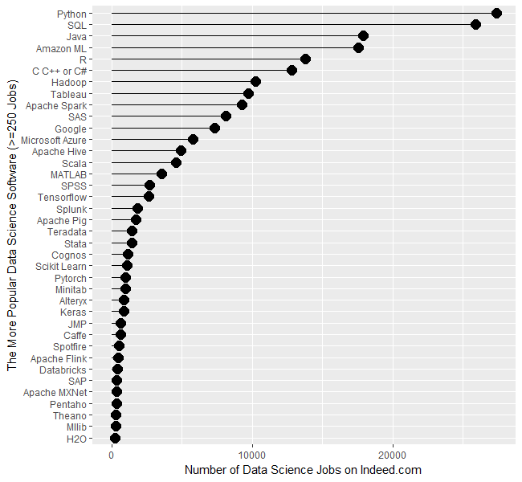
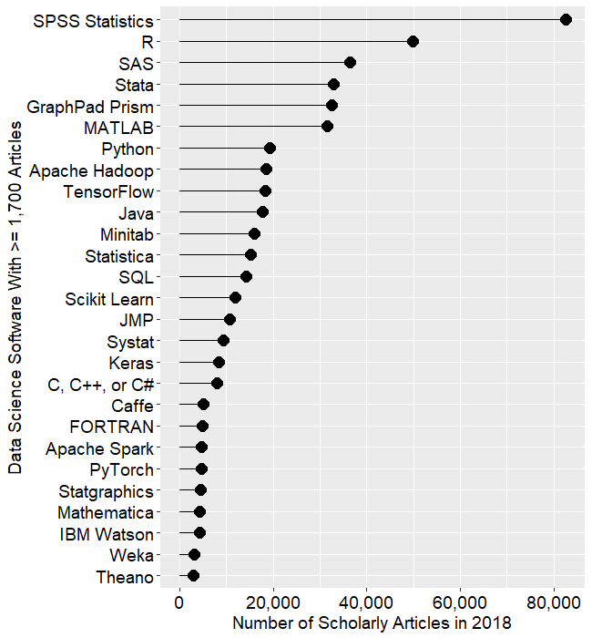
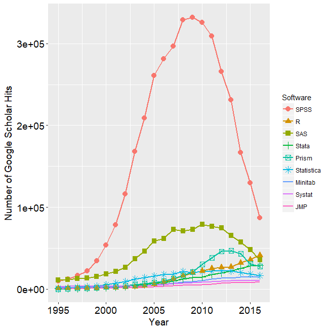

```{r xaringan-themer, include=FALSE, warning=FALSE}
require(xaringanthemer)
require(xaringanExtra)
style_duo(primary_color = "#e3e3e2", secondary_color = "#a6873b")
```

```{r xaringan-panelset, echo=FALSE}
xaringanExtra::use_panelset()
```

class: title-slide, right, top
background-image: url(img/canopy_logo.png)
background-size: 50%, cover

.right-column[
# `r rmarkdown::metadata$title`
### `r rmarkdown::metadata$subtitle`

**`r rmarkdown::metadata$author`**<br>
`r rmarkdown::metadata$institute`<br>
`r rmarkdown::metadata$date`
]


---
background-image: url(img/canopy_logo.png)
background-size: 14%, cover
background-position: 99% 4%

# .center[Why R?]

.pull-left[
## R/ R Studio

- Free
- Open Source
- Large User Base/Community
- Cutting-Edge Statistics
- Reproducibility
- Version Control/Collaboration
]

.pull-right[
## R Markdown

- Reproducibility
- Communication
]

---
class: center
# Growth of R

.panelset[
.panel[.panel-name[Jobs]

] <!---->

.panel[.panel-name[2018 Articles]

] <!---->

.panel[.panel-name[1995 - 2016 Articles]

] <!---->

] <!--end of panelset-->


---
# .center[You Can Do All Sorts of Cool Stuff In R]
