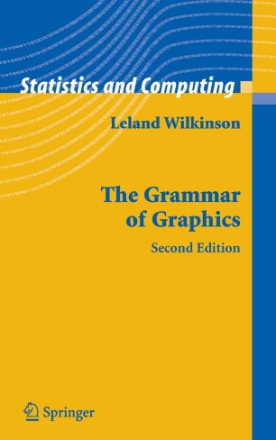
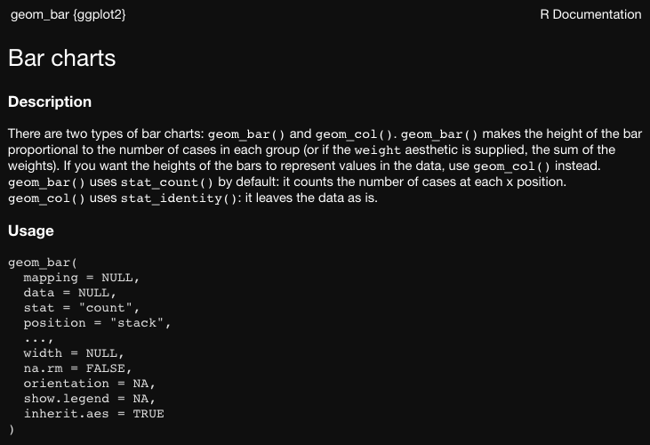
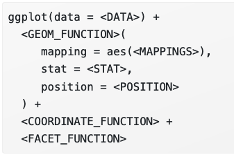
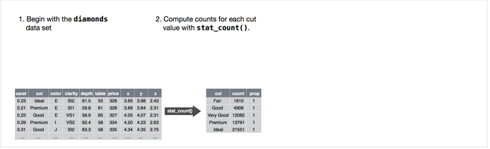
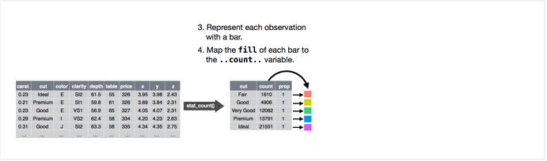
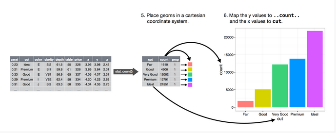

```{r xaringan-themer, include=FALSE, warning=FALSE}
require(xaringanthemer)
require(xaringanExtra)
require(icons)
style_duo(primary_color = "#e3e3e2", 
          secondary_color = "#8a2377",
          code_inline_color = "#7f6a8f",
          text_font_size = "1.1rem",
          header_font_google = google_font("Lato"),
          text_font_google   = google_font("Lora"),
          code_font_google   = google_font("Space Mono")
          )
```

```{r xaringan-panelset, echo=FALSE}
xaringanExtra::use_panelset()
xaringanExtra::use_tile_view()
xaringanExtra::use_clipboard()
xaringanExtra::use_scribble()
xaringanExtra::use_search(show_icon = FALSE)
xaringanExtra::use_extra_styles(
  hover_code_line = TRUE,         #<<
  mute_unhighlighted_code = TRUE  #<<
)
```

class: title-slide, right, top
background-image: url(img/hex_ggplot2.png), url(img/axsome_logo.png)
background-position: 93% 63%, 50% 50%
background-size: 10%, 40%

```{r xaringan-logo, echo=FALSE}
xaringanExtra::use_logo(
  image_url = "img/axsome_logo.png",
  position = xaringanExtra::css_position(top = ".5em", right = ".5em"),
  height = "130px",
  width = "150px",
  exclude_class = c("title-slide", "inverse", "hide_logo")
)
```


.right-column[
# `r rmarkdown::metadata$title`
### `r rmarkdown::metadata$subtitle`

**`r rmarkdown::metadata$author`**<br>
`r rmarkdown::metadata$institute`<br>
`r rmarkdown::metadata$date`
]


---
class: inverse, center, middle


# Graphics Have Grammars?
----
`r icons::icon_style(icons::fontawesome("r-project"), scale = 3, fill = "white")`


---

.center[
# Grammar of Graphics
]

.pull-left[
- Proposed by Leland Wilkinson in 2005
- Attempt to describe the essential features that underlie all statistical graphics
  1. Graph is a mapping of data to aesthetic attributes (color, shape, size) of geometric objects (lines, bars, points)
  1. Graph may contain statistical transformations of the data
  1. Graph is drawn on a specific coordinate system
  1. Facetting can be used to create small mulitiples of graphs
]

.pull-right[
.center[]
]


---

.center[
# Fundamental Components of a Graph
]

.pull-left[
1. **Data**  to visualize and **aesthetic mappings** of how aesthetics are applied to data
1. **Layers** of geometric elements and statistical transformations
  - **geoms** are what you see on the plot (e.g., lines, points, etc.)
  - **stats** summarize data (e.g., group mean)
1. **Scales** map values in data space to values in an aesthetic space
1. **Coord**inates describe how data coordinates are mapped to the plane of the graphic
1. **Facet**ing describes how to break up data into subsets (e.g., small multiples)
1. **Theme** controls finer points of display (e.g., font size, background color, etc.)
]

.pull-right[
<br>
.center[]
]

---
class: inverse, center, middle


# Let's Get Plotting!
----
`r icons::icon_style(icons::fontawesome("chart-line"), scale = 3, fill = "white")`


---

.center[
# First, The Dataset
]

```{r echo = FALSE, warning = FALSE, message = FALSE}
require(tidyverse)
require(DT)
datatable(mpg, 
              rownames = FALSE, 
              caption = "mpg Dataset",
              options = list(
                dom = 'tSp', 
                pageLength = 234,
                scrollY = "300px"))
```


---
.center[
# Create your first ggplot!
]

.pull-left[
- Use `ggplot()` to initialize the plot
  - Creates a coordinate system to add layers to
     - Supply data to the plot using the `data` argument
- Add layers of geoms to the plot
  - Geoms require aesthetic mappings
     - Use `mapping` argument and `aes` function to specify
```{r plot1, fig.show = 'hide'}
ggplot(data = mpg) + 
  geom_point(mapping = aes(x = displ, y = hwy))
```

]

.pull-right[
```{r ref.label = 'plot1', echo = FALSE, fig.width = 7, fig.height = 7 * .619, warning = FALSE, message = FALSE}
```
]

---

.center[
# Additional Aesthetic Specifications
]

- We can supply additional aesthetic specifications in the `aes()` function (e.g., color, size, shape, alpha, fill) and map these to variables in your data set

--

.panelset[

.panel[.panel-name[Color]

.pull-left[
```{r plot2, fig.show = 'hide'}
ggplot(data = mpg) + 
  geom_point(mapping = aes(x = displ, y = hwy, 
                           color = class))
```
]

.pull-right[
```{r ref.label = 'plot2', echo = FALSE, fig.width = 7, fig.height = 7 * .619, warning = FALSE, message = FALSE}
```

]


]<!---->

.panel[.panel-name[Size]

.pull-left[
```{r plot3, fig.show = 'hide'}
ggplot(data = mpg) + 
  geom_point(mapping = aes(x = displ, y = hwy, 
                           size = class))
```
]

.pull-right[
```{r ref.label = 'plot3', echo = FALSE, fig.width = 7, fig.height = 7 * .619, warning = FALSE, message = FALSE}
```

]
]<!---->

.panel[.panel-name[Alpha]

.pull-left[
```{r plot4, fig.show = 'hide'}
ggplot(data = mpg) + 
  geom_point(mapping = aes(x = displ, y = hwy, 
                           alpha = class))
```
]

.pull-right[
```{r ref.label = 'plot4', echo = FALSE, fig.width = 7, fig.height = 7 * .619, warning = FALSE, message = FALSE}
```

]
]<!---->


.panel[.panel-name[Shape]

.pull-left[
```{r plot5, fig.show = 'hide'}
ggplot(data = mpg) + 
  geom_point(mapping = aes(x = displ, y = hwy, 
                           shape = class))
```
]

.pull-right[
```{r ref.label = 'plot5', echo = FALSE, fig.width = 7, fig.height = 7 * .619, warning = FALSE, message = FALSE}
```

]
]<!---->

]<!--end panelset-->


---

.center[
# Additional Aesthetic Specifications
]

- We can supply additional aesthetic specifications in the `aes()` function (e.g., color, size, shape, alpha, fill) and map these to variables in your data set


.panelset[

.panel[.panel-name[Color]

.pull-left[
```{r plot6, fig.show = 'hide'}
ggplot(data = mpg) + 
  geom_point(mapping = aes(x = displ, y = hwy, 
                           color = class))
```
]

.pull-right[
```{r ref.label = 'plot6', echo = FALSE, fig.width = 7, fig.height = 7 * .619, warning = FALSE, message = FALSE}
```

]
]<!---->

.panel[.panel-name[Size]

.pull-left[
```{r plot7, fig.show = 'hide', warning = FALSE, message = FALSE}
ggplot(data = mpg) + 
  geom_point(mapping = aes(x = displ, y = hwy, 
                           size = class))
```
]

.pull-right[
```{r ref.label = 'plot7', echo = FALSE, fig.width = 7, fig.height = 7 * .619, warning = FALSE, message = FALSE}
```

]
]<!---->

.panel[.panel-name[Alpha]

.pull-left[
```{r plot8, fig.show = 'hide', warning = FALSE, message = FALSE}
ggplot(data = mpg) + 
  geom_point(mapping = aes(x = displ, y = hwy, 
                           alpha = class))
```
]

.pull-right[
```{r ref.label = 'plot8', echo = FALSE, fig.width = 7, fig.height = 7 * .619, warning = FALSE, message = FALSE}
```

]
]<!---->


.panel[.panel-name[Shape]

.pull-left[
```{r plot9, fig.show = 'hide', warning = FALSE, message = FALSE}
ggplot(data = mpg) + 
  geom_point(mapping = aes(x = displ, y = hwy, 
                           shape = class))
```
]

.pull-right[
```{r ref.label = 'plot9', echo = FALSE, fig.width = 7, fig.height = 7 * .619, warning = FALSE, message = FALSE}
```

]
]<!---->

]<!--end panelset-->


---
.center[
# Location, Location, Location!
]

- You can also set aesthetic properties of a geom manually
  - But pay attention to the location of the specification!

.panelset[
.panel[.panel-name[Correct Manual Color]

.center[
```{r fig.width = 5, fig.height = 5 * .619, warning = FALSE, message = FALSE}
ggplot(data = mpg) + 
  geom_point(mapping = aes(x = displ, y = hwy), color = "blue")
```
]
]<!---->

.panel[.panel-name[Incorrect Manual Color]

.center[
```{r fig.width = 5, fig.height = 5 * .619, warning = FALSE, message = FALSE}
ggplot(data = mpg) + 
  geom_point(mapping = aes(x = displ, y = hwy, color = "blue"))
```
]
]<!---->

]<!--end panelset-->


---

.center[
# Now You Try!
]

- Map a continuous variable to `color`, `size`, `shape`, and `alpha`.  How do these aesthetics behave differently for categorical versus continuous variables?

`r countdown::countdown(minutes = 3, seconds = 00, play_sound = TRUE, left = 0, right = 0, padding = "50px",margin = "15%", font_size = "6em", color_running_background = "#e3e3e2", color_running_text = "#a6873b", color_finished_background = "#a6873b", color_finished_text = "#e3e3e2")`


---

.center[
# Let's See!
]

.panelset[
.panel[.panel-name[Color]

.pull-left[
```{r plot_ls1, fig.show = 'hide', warning = FALSE, message = FALSE}
ggplot(data = mpg) + 
  geom_point(mapping = aes(x = displ, y = hwy, 
                           color = cty))
```
]

.pull-right[
```{r ref.label = 'plot_ls1', echo = FALSE, fig.width = 7, fig.height = 7 * .619, warning = FALSE, message = FALSE}
```

]
] <!---->

.panel[.panel-name[Size]

.pull-left[
```{r plot_ls2, fig.show = 'hide', warning = FALSE, message = FALSE}
ggplot(data = mpg) + 
  geom_point(mapping = aes(x = displ, y = hwy, 
                           size = cty))
```
]

.pull-right[
```{r ref.label = 'plot_ls2', echo = FALSE, fig.width = 7, fig.height = 7 * .619, warning = FALSE, message = FALSE}
```
]
] <!---->

.panel[.panel-name[Shape]

.pull-left[
```{r plot_ls3, fig.show = 'hide', warning = FALSE, message = FALSE, error = TRUE}
ggplot(data = mpg) + 
  geom_point(mapping = aes(x = displ, y = hwy, 
                           shape = cty))
```
]

] <!---->

.panel[.panel-name[Alpha]

.pull-left[
```{r plot_ls4, fig.show = 'hide', warning = FALSE, message = FALSE}
ggplot(data = mpg) + 
  geom_point(mapping = aes(x = displ, y = hwy, 
                           alpha = cty))
```
]

.pull-right[
```{r ref.label = 'plot_ls4', echo = FALSE, fig.width = 7, fig.height = 7 * .619, warning = FALSE, message = FALSE}
```
]
] <!---->


] <!--end of panelset-->


---

.center[
# Facet-nating
]

- Facets create small multiples of plots for each level of a categorical variables using `facet_wrap()` and `facet_grid()` 

.panelset[
.panel[.panel-name[Facet Wrap]

.pull-left[
```{r plot10, fig.show = 'hide', warning = FALSE, message = FALSE}
ggplot(data = mpg) + 
  geom_point(mapping = aes(x = displ, y = hwy)) + 
  facet_wrap(~ class, nrow = 2)
```
]

.pull-right[
```{r ref.label = 'plot10', echo = FALSE, fig.width = 6, fig.height = 6 * .619, warning = FALSE, message = FALSE}
```
]
]<!---->

.panel[.panel-name[Facet Grid]

.pull-left[
```{r plot11, fig.show = 'hide', warning = FALSE, message = FALSE}
ggplot(data = mpg) + 
  geom_point(mapping = aes(x = displ, y = hwy)) + 
  facet_grid(drv ~ cyl)
```
]

.pull-right[
```{r ref.label = 'plot11', echo = FALSE, fig.width = 6, fig.height = 6 * .619, warning = FALSE, message = FALSE}
```
]

]<!---->


.panel[.panel-name[Horizontal Facet]

.pull-left[
```{r plot12, fig.show = 'hide', warning = FALSE, message = FALSE}
ggplot(data = mpg) + 
  geom_point(mapping = aes(x = displ, y = hwy)) + 
  facet_grid(. ~ cyl)
```
]

.pull-right[
```{r ref.label = 'plot12', echo = FALSE, fig.width = 6, fig.height = 6 * .619, warning = FALSE, message = FALSE}
```
]

]<!---->


.panel[.panel-name[Vertical Facet]

.pull-left[
```{r plot13, fig.show = 'hide', warning = FALSE, message = FALSE}
ggplot(data = mpg) + 
  geom_point(mapping = aes(x = displ, y = hwy)) + 
  facet_grid(cyl ~ .)
```
]

.pull-right[
```{r ref.label = 'plot13', echo = FALSE, fig.width = 6, fig.height = 6 * .619, warning = FALSE, message = FALSE}
```
]

]<!---->

]<!--end panelset-->


---

.center[
# Geometric Objects
]

- There are many different `geoms`
- The type of `geom` often defines the type of graph (e.g., line, bar, boxplot, etc.)
- Different geoms may have different arguments (e.g., `method` for `geom_smooth`)


.panelset[
.panel[.panel-name[Scatter]

.pull-left[
```{r plot14, fig.show = 'hide', warning = FALSE, message = FALSE}
ggplot(data = mpg) + 
  geom_point(mapping = aes(x = displ, y = hwy))
```
]

.pull-right[
```{r ref.label = 'plot14', echo = FALSE, fig.width = 6, fig.height = 6 * .619, warning = FALSE, message = FALSE}
```
]

]<!---->

.panel[.panel-name[Smooth, "loess"]

.pull-left[
```{r plot15, fig.show = 'hide', warning = FALSE, message = FALSE}
ggplot(data = mpg) + 
  geom_smooth(mapping = aes(x = displ, y = hwy), method = "loess")
```
]

.pull-right[
```{r ref.label = 'plot15', echo = FALSE, fig.width = 6, fig.height = 6 * .619, warning = FALSE, message = FALSE}
```
]

]<!---->

.panel[.panel-name[Smooth, "lm"]

.pull-left[
```{r plot16, fig.show = 'hide', warning = FALSE, message = FALSE}
ggplot(data = mpg) + 
  geom_smooth(mapping = aes(x = displ, y = hwy), method = "lm")
```
]

.pull-right[
```{r ref.label = 'plot16', echo = FALSE, fig.width = 6, fig.height = 6 * .619, warning = FALSE, message = FALSE}
```
]

]<!---->

.panel[.panel-name[Smooth, "gam"]

.pull-left[
```{r plot17, fig.show = 'hide', warning = FALSE, message = FALSE}
ggplot(data = mpg) + 
  geom_smooth(mapping = aes(x = displ, y = hwy), method = "gam")
```
]

.pull-right[
```{r ref.label = 'plot17', echo = FALSE, fig.width = 6, fig.height = 6 * .619, warning = FALSE, message = FALSE}
```
]

]<!---->


]<!--end panel set-->


---

.center[
# Getting More from Your Plots
]

- We can use additional specifications to:
  - Look at different smooth lines as a function of a third variable
  - Overlay raw points on our plot

--

.panelset[
.panel[.panel-name[Linetype]

.pull-left[
```{r plot18, fig.show = 'hide', warning = FALSE, message = FALSE}
ggplot(data = mpg) + 
  geom_smooth(mapping = aes(x = displ, y = hwy, linetype = drv))
```
]

.pull-right[
```{r ref.label = 'plot18', echo = FALSE, fig.width = 6, fig.height = 6 * .619, warning = FALSE, message = FALSE}
```
]

]<!---->

.panel[.panel-name[Color]

.pull-left[
```{r plot19, fig.show = 'hide', warning = FALSE, message = FALSE}
ggplot(data = mpg) + 
  geom_smooth(mapping = aes(x = displ, y = hwy, color = drv))
```
]

.pull-right[
```{r ref.label = 'plot19', echo = FALSE, fig.width = 6, fig.height = 6 * .619, warning = FALSE, message = FALSE}
```
]

]<!---->

.panel[.panel-name[Overlay Points]

.pull-left[
```{r plot20, fig.show = 'hide', warning = FALSE, message = FALSE}
ggplot(data = mpg) + 
  geom_smooth(mapping = aes(x = displ, y = hwy)) + 
  geom_point(mapping = aes(x = displ, y = hwy))
```
]

.pull-right[
```{r ref.label = 'plot20', echo = FALSE, fig.width = 6, fig.height = 6 * .619, warning = FALSE, message = FALSE}
```
]

]<!---->

.panel[.panel-name[Overlay Points and Color!]

.pull-left[
```{r plot21, fig.show = 'hide', warning = FALSE, message = FALSE}
ggplot(data = mpg) + 
  geom_smooth(mapping = aes(x = displ, y = hwy, color = drv)) + 
  geom_point(mapping = aes(x = displ, y = hwy, color = drv))
```
]

.pull-right[
```{r ref.label = 'plot21', echo = FALSE, fig.width = 6, fig.height = 6 * .619, warning = FALSE, message = FALSE}
```
]

]<!---->


.panel[.panel-name[Fill]

.pull-left[
```{r plot22, fig.show = 'hide', warning = FALSE, message = FALSE}
ggplot(data = mpg) + 
  geom_smooth(mapping = aes(x = displ, y = hwy, color = drv, fill = drv)) + 
  geom_point(mapping = aes(x = displ, y = hwy, color = drv))
```
]

.pull-right[
```{r ref.label = 'plot22', echo = FALSE, fig.width = 6, fig.height = 6 * .619, warning = FALSE, message = FALSE}
```
]

]<!---->


]<!--end panel set-->


---

.center[
# Location, Location, Location - Part 2!
]

- These two specifications produce the same plot
- Aesthetic mappings in a `ggplot()` function are passed on to all subsequent geoms

.pull-left[

```{r fig.height = 3.5, warning = FALSE, message = FALSE}
ggplot(data = mpg) + 
  geom_smooth(mapping = aes(x = displ, y = hwy, color = drv, fill = drv)) + 
  geom_point(mapping = aes(x = displ, y = hwy, color = drv))
```

]


.pull-right[
```{r fig.height = 3.5, warning = FALSE, message = FALSE}
ggplot(data = mpg, mapping = aes(x = displ, y = hwy, color = drv, fill = drv)) + 
  geom_smooth() + 
  geom_point()
```

]


---

.center[
# Let's Make a Mistake
]

- What do you think will happen if I run the following code?

```{r plot23, fig.show = 'hide', warning = FALSE, message = FALSE, error = TRUE, eval = FALSE}
ggplot(data = mpg) + 
  geom_smooth(mapping = aes(x = displ, y = hwy), color = drv) 
```

--

```{r ref.label = 'plot23', echo = FALSE, fig.width = 6, fig.height = 6 * .619, warning = TRUE, message = TRUE, error = TRUE}
```


---

.center[
# Let's Work with a New Dataset!
]

```{r echo = FALSE}
knitr::kable(head(diamonds),
            format = "html",
            caption = "diamonds dataset")
```


---

.center[
# Statistical Transformations
]

.pull-left[
- Statistical transformations are any instance in which new values are calculated in the process of creating a plot
- Not present in scatter plots
- But we did see them in our smooth line plots
]

.pull-right[
```{r echo = FALSE, message = FALSE, warning = FALSE, fig.width = 7, fig.height = 7 * .619}
ggplot(data = mpg) + 
  geom_smooth(mapping = aes(x = displ, y = hwy), method = "lm") + 
  geom_point(mapping = aes(x = displ, y = hwy))
```

]


---

.center[
# Bar Charts
]

- Bar charts are a prototypical example of a statistical transformation
- Note that bar charts present the frequency count of a variable
- But frequency count was not a variable in our original dataset!

.panelset[
.panel[.panel-name[Bar Chart Plot]

.pull-left[
```{r plot24, fig.show = 'hide', warning = FALSE, message = FALSE}
ggplot(data = diamonds) + 
  geom_bar(mapping = aes(x = cut))
```
]

.pull-right[
```{r ref.label = 'plot24', echo = FALSE, fig.width = 6, fig.height = 6 * .619, warning = FALSE, message = FALSE}
```
]

]<!---->

.panel[.panel-name[Bar Chart Transformation]

.center[
<br>
.caption[Figure from [R for Data Science](https://r4ds.had.co.nz/data-visualisation.html)]
]

]<!---->

.panel[.panel-name[Default Transformation]

.center[]


]<!---->

.panel[.panel-name[stat_count]

.pull-left[
```{r plot25, fig.show = 'hide', warning = FALSE, message = FALSE}
ggplot(data = diamonds) + 
  stat_count(mapping = aes(x = cut))
```
]

.pull-right[
```{r ref.label = 'plot25', echo = FALSE, fig.width = 6, fig.height = 6 * .619, warning = FALSE, message = FALSE}
```
]
]<!---->

]<!--end panel set-->


---
.center[
# Changing the Default Transformation
]

- use the `stat` argument to change the default transformatoin

.pull-left[
```{r}
dat <- data.frame(group = c("group_a", "group_b", "group_c"), 
                  group_mean = c(32, 25, 44))
dat
```

]

.pull-right[
```{r fig.width = 6, fig.height = 6 * .619}
ggplot(dat) + 
  geom_bar(mapping = aes(x = group, y = group_mean),
           stat = "identity")
```

]
---

.center[
# Statistical Transformation Summary
]

- Each `geom` has a default statistical transformation
<br> <br>
- Each `stat` in turn has a default geometric object
<br> <br>
- `stat_` can often be used interchangeably with `geom_`
<br> <br>
- We often needn't worry about the statistical transformation when using a `geom` because of these defaults
<br> <br>
- However, we can change the default transformation if necessary


---

.center[
# Let's Try Adding Some Color!
]

- What will happen if I map `cut` to color for a bar plot?  What will happen if I map `cut` to fill?

--

.panelset[
.panel[.panel-name[Color Mapping]

.pull-left[

```{r plot26, fig.show = 'hide', warning = FALSE, message = FALSE}
ggplot(data = diamonds) + 
  geom_bar(mapping = aes(x = cut, color = cut))
```

]

.pull-right[
```{r ref.label = 'plot26', echo = FALSE, fig.width = 6, fig.height = 6 * .619, warning = FALSE, message = FALSE}
```
]

]<!---->

.panel[.panel-name[Fill Mapping]

.pull-left[

```{r plot27, fig.show = 'hide', warning = FALSE, message = FALSE}
ggplot(data = diamonds) + 
  geom_bar(mapping = aes(x = cut, fill = cut))
```

]

.pull-right[
```{r ref.label = 'plot27', echo = FALSE, fig.width = 6, fig.height = 6 * .619, warning = FALSE, message = FALSE}
```
]

]<!---->

]<!--end panel set-->


---

.center[
# Position Adjustment
]


.panelset[
.panel[.panel-name[Default Stack]

.left-column[

- Bars are stacked by default
- Each colored rectangle is a combination of cut and clarity
]

.right-column[

```{r fig.width = 5, fig.height = 5 * .619, message = FALSE, warning = FALSE}
ggplot(data = diamonds) + 
  geom_bar(mapping = aes(x = cut, fill = clarity))
```

]

]<!---->


.panel[.panel-name[Fill]

.left-column[

- To change positioning, use the `position` argument
- "fill" will retain stacking, but stacked bars will be the same height
  - good for comparing proportions
]

.right-column[

```{r fig.width = 5, fig.height = 5 * .619, message = FALSE, warning = FALSE}
ggplot(data = diamonds) + 
  geom_bar(mapping = aes(x = cut, fill = clarity), 
           position = "fill")
```

]

]<!---->


.panel[.panel-name[Dodge]

.left-column[

- To position side-by-side, use `position = "dodge"`
]

.right-column[

```{r fig.width = 5, fig.height = 5 * .619, message = FALSE, warning = FALSE}
ggplot(data = diamonds) + 
  geom_bar(mapping = aes(x = cut, fill = clarity), 
           position = "dodge")
```

]

]<!---->


]<!--end panel set-->

---

.center[
# Scatterplot Position Adjustment 
]

- Some of the data points overlaped with one another
- Use `position = "jitter"` to slightly perturb the position of points

.pull-left[
```{r fig.width = 6, fig.height = 6 * .619, message = FALSE, warnning = FALSE}
ggplot(data = mpg) + 
  geom_point(mapping = aes(x = displ, y = hwy))
```

]

.pull-right[
```{r fig.width = 6, fig.height = 6 * .619, message = FALSE, warnning = FALSE}
ggplot(data = mpg) + 
  geom_point(mapping = aes(x = displ, y = hwy), 
             position = "jitter")
```

]


---

.center[
# Coordinate Systems
]

- The Cartesian coordinate system is the default for ggplot and is the one we'll mostly use
  - Flipping x and y coordinates is often useful
- There are others that are important, especially for spatial data, but we won't cover them

.panelset[

.panel[.panel-name[Original]

.pull-left[

```{r plot_original, fig.show = 'hide', warning = FALSE, message = FALSE}
ggplot(data = diamonds) + 
  geom_bar(mapping = aes(x = cut, fill = cut))
```

]

.pull-right[
```{r ref.label = 'plot_original', echo = FALSE, fig.width = 6, fig.height = 6 * .619, warning = FALSE, message = FALSE}
```
]

]<!---->

.panel[.panel-name[`coord_flip`]

.pull-left[

```{r plot28, fig.show = 'hide', warning = FALSE, message = FALSE}
ggplot(data = diamonds) + 
  geom_bar(mapping = aes(x = cut, fill = cut)) + 
  coord_flip()
```

]

.pull-right[
```{r ref.label = 'plot28', echo = FALSE, fig.width = 6, fig.height = 6 * .619, warning = FALSE, message = FALSE}
```
]

]<!---->

.panel[.panel-name[Specify in `aes`]

.pull-left[

```{r plot29, fig.show = 'hide', warning = FALSE, message = FALSE}
ggplot(data = diamonds) + 
  geom_bar(mapping = aes(y = cut, fill = cut))
```

]

.pull-right[
```{r ref.label = 'plot29', echo = FALSE, fig.width = 6, fig.height = 6 * .619, warning = FALSE, message = FALSE}
```
]

]<!---->

]<!--end panel set-->

---

.center[
# Themes!
]

- Themes control the finer points of display, like font type, font size, thickness of axes, tick marks, etc.
- You can create your own theme or use pre-created themes in `ggplot2` or extension packages (like ggthemes)
- Below are some examples of alternative `ggplot2` themes

.panelset[
.panel[.panel-name[Default]

.pull-left[
```{r plot_default, fig.show = 'hide', warning = FALSE, message = FALSE}
ggplot(data = mpg) + 
  geom_smooth(mapping = aes(x = displ, y = hwy, color = drv, fill = drv)) + 
  geom_point(mapping = aes(x = displ, y = hwy, color = drv))
```
]

.pull-right[
```{r ref.label = 'plot_default', echo = FALSE, fig.width = 6, fig.height = 6 * .619, warning = FALSE, message = FALSE}
```
]

]<!---->


.panel[.panel-name[`theme_minimal`]

.pull-left[
```{r plot30, fig.show = 'hide', warning = FALSE, message = FALSE}
ggplot(data = mpg) + 
  geom_smooth(mapping = aes(x = displ, y = hwy, color = drv, fill = drv)) + 
  geom_point(mapping = aes(x = displ, y = hwy, color = drv)) + 
  theme_minimal()
```
]

.pull-right[
```{r ref.label = 'plot30', echo = FALSE, fig.width = 6, fig.height = 6 * .619, warning = FALSE, message = FALSE}
```
]

]<!---->

.panel[.panel-name[`theme_dark`]

.pull-left[
```{r plot31, fig.show = 'hide', warning = FALSE, message = FALSE}
ggplot(data = mpg) + 
  geom_smooth(mapping = aes(x = displ, y = hwy, color = drv, fill = drv)) + 
  geom_point(mapping = aes(x = displ, y = hwy, color = drv)) + 
  theme_dark()
```
]

.pull-right[
```{r ref.label = 'plot31', echo = FALSE, fig.width = 6, fig.height = 6 * .619, warning = FALSE, message = FALSE}
```
]

]<!---->

.panel[.panel-name[`theme_light`]

.pull-left[
```{r plot32, fig.show = 'hide', warning = FALSE, message = FALSE}
ggplot(data = mpg) + 
  geom_smooth(mapping = aes(x = displ, y = hwy, color = drv, fill = drv)) + 
  geom_point(mapping = aes(x = displ, y = hwy, color = drv)) + 
  theme_light()
```
]

.pull-right[
```{r ref.label = 'plot32', echo = FALSE, fig.width = 6, fig.height = 6 * .619, warning = FALSE, message = FALSE}
```
]

]<!---->

.panel[.panel-name[`theme_bw`]

.pull-left[
```{r plot33, fig.show = 'hide', warning = FALSE, message = FALSE}
ggplot(data = mpg) + 
  geom_smooth(mapping = aes(x = displ, y = hwy, color = drv, fill = drv)) + 
  geom_point(mapping = aes(x = displ, y = hwy, color = drv)) + 
  theme_bw()
```
]

.pull-right[
```{r ref.label = 'plot33', echo = FALSE, fig.width = 6, fig.height = 6 * .619, warning = FALSE, message = FALSE}
```
]

]<!---->


]<!--end panel set-->


---

.center[
# Bringing it All Together!
]

.panelset[
.panel[.panel-name[Formula]
- The following can be used a default template for ggplots: <br> <br>

<br>
.caption[Formula from [R for Data Science](https://r4ds.had.co.nz/data-visualisation.html)]
<br>
- Not all of these parameters need to be specified, defaults are often adequate

]<!---->


.panel[.panel-name[Steps 1 and 2]


<br>
.caption[Figure from [R for Data Science](https://r4ds.had.co.nz/data-visualisation.html)]

]<!---->

.panel[.panel-name[Steps 3 and 4]


<br>
.caption[Figure from [R for Data Science](https://r4ds.had.co.nz/data-visualisation.html)]

]<!---->


.panel[.panel-name[Steps 5 and 6]


<br>
.caption[Figure from [R for Data Science](https://r4ds.had.co.nz/data-visualisation.html)]

]<!---->


]<!--end panel set-->


---

.center[
# Scaffolding Resources
]

<br>

<br>

[Data to Viz Website](https://www.data-to-viz.com/)


<br>


[esquisse Package](https://cran.r-project.org/web/packages/esquisse/vignettes/get-started.html)

