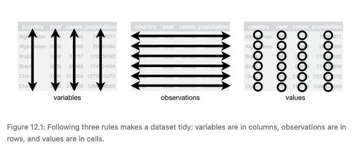
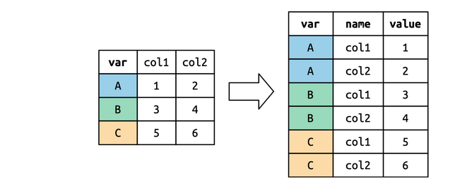
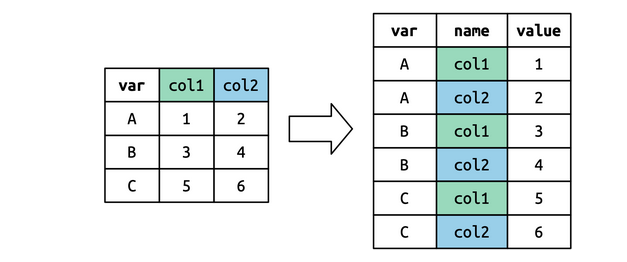
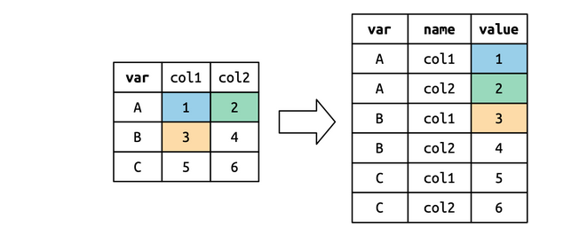
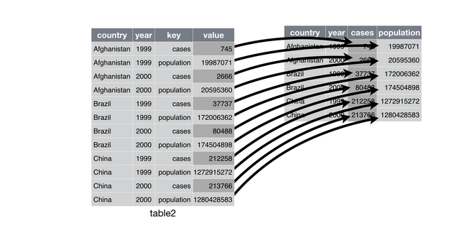
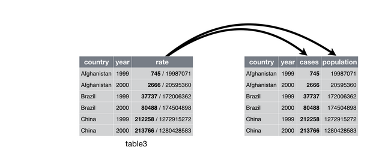
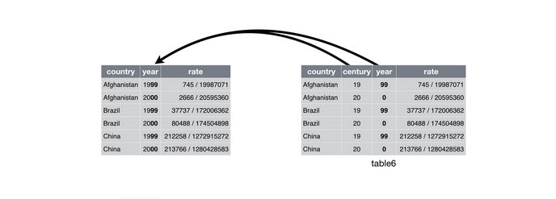

```{r xaringan-themer, include=FALSE, warning=FALSE}
require(xaringanthemer)
require(xaringanExtra)
require(icons)
require(palmerpenguins)
require(tidyverse)
style_duo(primary_color = "#e3e3e2", 
          secondary_color = "#a6873b",
          code_inline_color = "#746850",
          text_font_size = "1.1rem",
          header_font_google = google_font("Lato"),
          text_font_google   = google_font("Lora"),
          code_font_google   = google_font("Space Mono")
          )
```

```{r xaringan-panelset, echo=FALSE}
xaringanExtra::use_panelset()
xaringanExtra::use_tile_view()
xaringanExtra::use_clipboard()
xaringanExtra::use_scribble()
xaringanExtra::use_search(show_icon = FALSE)
xaringanExtra::use_extra_styles(
  hover_code_line = TRUE,         #<<
  mute_unhighlighted_code = TRUE  #<<
)
```

class: title-slide, right, top
background-image: url(img/hex_tidyr.png), url(img/canopy_logo.png)
background-position: 93% 63%, 50% 50%
background-size: 10%, 50%

```{r xaringan-logo, echo=FALSE}
xaringanExtra::use_logo(
  image_url = "img/canopy_logo.png",
  position = xaringanExtra::css_position(top = ".5em", right = ".5em"),
  height = "140px",
  width = "160px",
  exclude_class = c("title-slide", "inverse", "hide_logo")
)
```


.right-column[
# `r rmarkdown::metadata$title`
### `r rmarkdown::metadata$subtitle`

**`r rmarkdown::metadata$author`**<br>
`r rmarkdown::metadata$institute`<br>
`r rmarkdown::metadata$date`
]


---
class: inverse, center, middle


# Tidy Data Overview!
----
`r icons::icon_style(icons::fontawesome("r-project"), scale = 3, fill = "white")`


---

.center[
# Tidy Data Overview
]

.pull-left[
- `tidyr` is designed to create tidy data
- Tidy data is data where:
   - Every column is variable.
   - Every row is an observation.
   - Every cell is a single value.
- Tidy data is a standard way of storing data that is used wherever possible throughout the tidyverse. 
- Tidy data leads to less time battling with tidyverse functions, more time analyzing data
]

.pull-right[

.center[

.caption[
Via [Giphy](https://media.giphy.com/media/uWzDsAsRm2X9qULHLs/giphy.gif)
]
]
]


---

.center[
# Tidy Data Overview
]

.center[

.caption[
From [R for Data Science](https://r4ds.had.co.nz/tidy-data.html)
]
]

<br>

.left[
[You can read more about Tidy data in Hadley Wickham's tidy data article](https://www.jstatsoft.org/article/download/v059i10/772)
]


---
.center[
# Tidy and Non-Tidy Data Examples
]


.panelset[

.panel[.panel-name[Example 1]

```{r echo = FALSE, warning = FALSE, message = FALSE}
table1 %>% 
  knitr::kable()
```

]<!---->

.panel[.panel-name[Example 2]

```{r echo = FALSE, warning = FALSE, message = FALSE}
table2 %>% 
  knitr::kable()
```


]<!---->

.panel[.panel-name[Example 3]

```{r echo = FALSE, warning = FALSE, message = FALSE}
table3 %>% 
  knitr::kable()
```


]<!---->


.panel[.panel-name[Example 4]

.pull-left[
```{r echo = FALSE, warning = FALSE, message = FALSE}
table4a %>% 
  knitr::kable(caption = "Cases")
```
]

.pull-right[
```{r echo = FALSE, warning = FALSE, message = FALSE}
table4b %>% 
  knitr::kable(caption = "Population")
```

]
]<!---->

.panel[.panel-name[Example 5]

```{r echo = FALSE, warning = FALSE, message = FALSE}
table5 %>% 
  knitr::kable()
```


]<!---->

]<!--end panelset-->


---

.center[
# Tidy Data is Built for Analysis!
]

.pull-left[

```{r warning = FALSE, message = FALSE}
table1 %>% 
  mutate(rate = cases / population * 10000) %>% 
  knitr::kable()
```

]

.pull-right[

```{r warning = FALSE, message = FALSE, fig.width = 6, fig.height = 6 * .619}
ggplot(table1, aes(year, cases)) +
  geom_line(aes(group = country), color = "grey50") +
  geom_point(aes(color = country, shape = country)) +
  scale_x_continuous(breaks = c(1999, 2000))
```

]


---
class: inverse, center, middle


# Pivoting!
----
`r icons::icon_style(icons::fontawesome("r-project"), scale = 3, fill = "white")`


---

.center[
# Pivoting
]

- Most real data is untidy
   - 80% of data science is data wrangling, 20% is analysis <br> <br>
- `tidyr` provides several helpful functions for getting data into a usable format for analysis <br> <br>
- the most common data tidying task is pivoting <br> <br>
- `tidyr` includes two function for pivoting
   - `pivot_longer`: makes a dataset **longer** by increasing columns and reducing rows
   - `pivot_wider`: makes a dataset **wider** by increasing columns and reducing rows


---

.center[
# The Billboard Dataset
]

```{r echo = FALSE, warning = FALSE, message = FALSE}
DT::datatable(billboard, options = list(
  scrollY = 300,
  scrollX = 300,
  pageLength = 5,
  dom = "ltp",
  ordering = FALSE))
```


---

.center[
# The Billboard Dataset
]

- the first three columns are variables that describe the song
   - `artist`
   - `track`
   - `data.entered` <br> <br>
- the next 76 columns describe the rank of the song in each week
   - (`wk1`-`wk76`) <br> <br>
- we'd like the weeks to all fall under a single `week` column and the ranks to fall in a separate `rank` column
   - `pivot_longer()`!


---

.center[
# pivot_longer()
]

.panelset[

.panel[.panel-name[pivot_longer]

- there are three key arguments to `pivot_longer`
   1. `cols` specifies which columns need to be pivoted, i.e. which columns aren’t variables. 
      - This argument uses the same syntax as `select()` so here we could use `!c(artist, track, date.entered)` or `starts_with("wk")`.
   2. `names_to` names of the variable stored in the column names, here "week".
   3. `values_to` names the variable stored in the cell values, here "rank".
      

]<!---->

.panel[.panel-name[`pivot_longer` code]

```{r eval = FALSE}
billboard %>%  
  pivot_longer(
    cols = starts_with("wk"), 
    names_to = "week", 
    values_to = "rank"
  )
```


]<!---->

.panel[.panel-name[`pivot_longer` results]

```{r echo = FALSE}
billboard %>%  
  pivot_longer(
    cols = starts_with("wk"), 
    names_to = "week", 
    values_to = "rank"
  ) %>% 
  head(n = 8) %>% 
  knitr::kable()
```


]<!---->

.panel[.panel-name[`pivot_longer` values_drop_na]

.pull-left[
```{r eval = FALSE}
billboard %>%  
  pivot_longer(
    cols = starts_with("wk"), 
    names_to = "week", 
    values_to = "rank",
    values_drop_na = TRUE) %>% 
    slice(6:10) %>% 
```
]

.pull-right[

```{r echo = FALSE}
billboard %>%  
  pivot_longer(
    cols = starts_with("wk"), 
    names_to = "week", 
    values_to = "rank",
    values_drop_na = TRUE
  ) %>% 
  slice(6:10) %>% 
  knitr::kable()
```

]

]<!---->

]<!--end panelset-->


---

.center[
# How does pivot_longer work?
]

.panelset[

.panel[.panel-name[Step 1]

- columns that are already variables need to be repeated, once for each column that is pivotted

.center[

.caption[
From [R for Data Science](https://r4ds.had.co.nz/tidy-data.html)
]
]

]<!---->

.panel[.panel-name[Step 2]

- column names of pivoted columns become a new column

.center[

.caption[
From [R for Data Science](https://r4ds.had.co.nz/tidy-data.html)
]
]

]<!---->

.panel[.panel-name[Step 3]

- number of values is preserved (not repeated), but unwound row-by-row

.center[

.caption[
From [R for Data Science](https://r4ds.had.co.nz/tidy-data.html)
]
]

]<!---->

]<!--end panelset-->


---

.center[
# pivot_wider
]

- used when one observation is spread across multiple rows
   - less common than `pivot_wider()` <br> <br>
- opposite interface to `pivot_longer()` <br> <br>
- need to provide the existing columns that define the values
   - `values_from`
- and need to provide the existing columns that contain the columns names
   - `names_from`
   
---

.center[
# The table2 Dataset
]

```{r echo = FALSE, warning = FALSE, message = FALSE}
DT::datatable(table2, options = list(
  scrollY = 300,
  scrollX = 300,
  pageLength = 5,
  dom = "ltp",
  ordering = FALSE))
```


---

.center[
# pivot_wider()
]

.pull-left[

```{r eval = FALSE}
table2 %>% 
  pivot_wider(values_from = "count", 
              names_from = "type")
```

]

.pull-right[

```{r echo = FALSE}
table2 %>% 
  pivot_wider(values_from = "count", names_from = "type") %>% 
DT::datatable(options = list(
  scrollY = 300,
  scrollX = 300,
  pageLength = 6,
  dom = "t",
  ordering = FALSE))
```
]


---
.center[
# How does pivot_wider work?
]


.center[

.caption[
From [R for Data Science](https://r4ds.had.co.nz/tidy-data.html)
]
]


---


class: inverse, center, middle


# Separating and Uniting!
----
`r icons::icon_style(icons::fontawesome("r-project"), scale = 3, fill = "white")`


---

.center[
# Separate
]

.panelset[

.panel[.panel-name[Overview]

- `separate` pulls apart one column into multple columns, by splitting wherever a separator character appears

```{r echo = FALSE}
table3 %>% 
  knitr::kable()
```


]<!---->


.panel[.panel-name[Separate in Action!]

.pull-left[

```{r eval = FALSE}
table3 %>% 
  separate(rate, into = c("cases", "population"), 
           sep = "/")
```

- key arguments
   1. `data` - dataset to perform separation on
   2. `into` - names of resulting columns
   3. `sep` - value that defines the separator between columns
      - will default to first non-alphanumeric value if not specified

]

.pull-right[

```{r echo = FALSE}
table3 %>% 
  separate(rate, into = c("cases", "population"), sep = "/")
```

]
]<!---->


.panel[.panel-name[How does it work?]

.center[

.caption[
From [R for Data Science](https://r4ds.had.co.nz/tidy-data.html)
]
]

]<!---->


.panel[.panel-name[Convert]

.pull-left[

```{r eval = FALSE}
table3 %>% 
  separate(rate, into = c("cases", "population"), 
           sep = "/", 
           convert = TRUE)
```

- by default, `separate` will not change the type of the column
- to allow `separate` to change resulting column to a more appropriate type, set `convert = TRUE`
]

.pull-right[

```{r echo = FALSE}
table3 %>% 
  separate(rate, into = c("cases", "population"), sep = "/", convert = TRUE) %>% 
  head(6)
```

]

]<!---->

]<!--end panelset-->


---

.center[
# Unite
]


.panelset[

.panel[.panel-name[Overview]

- `unite` is the inverse of `separate`
   - combines multiple columns into a single column
-  used less frequently than `separate`

```{r echo = FALSE}
table5 
```


]<!---->


.panel[.panel-name[Unite in Action!]

.pull-left[

```{r eval = FALSE}
table5 %>% 
  unite("new", century, year, sep = "")
```

- key arguments
   1. `data` - dataset to perform separation on
   2. `col` - name of resulting columns
   3. `...` - names of columns to unite
      - uses `dplyr::select`-style syntax
  4. `sep` - the character used to separate united column values in new column
     - defaults to "_"

]

.pull-right[

```{r echo = FALSE}
table5 %>% 
  unite("new", 
        century, year,
        sep = "")
```

]
]<!---->


.panel[.panel-name[How does it work?]

.center[

.caption[
From [R for Data Science](https://r4ds.had.co.nz/tidy-data.html)
]
]

]<!---->

]<!--end panelset-->


---


class: inverse, center, middle


# Missing Data!
----
`r icons::icon_style(icons::fontawesome("r-project"), scale = 3, fill = "white")`


---


.center[
# Explicit vs. Implicit Missing Data
]

- a value can be missing in one of two possible ways
   -  explicltly: flagged as `NA`
   - implicitly:  simply not present in the data
   
.pull-left[   
```{r eval = FALSE}
stocks <- tibble(
  year   = c(2015, 2015, 2015, 2015, 2016, 2016, 2016),
  qtr    = c(   1,    2,    3,    4,    2,    3,    4),
  return = c(1.88, 0.59, 0.35,   NA, 0.92, 0.17, 2.66)
)
```
]

.pull-right[

```{r echo = FALSE}
stocks <- tibble(
  year   = c(2015, 2015, 2015, 2015, 2016, 2016, 2016),
  qtr    = c(   1,    2,    3,    4,    2,    3,    4),
  return = c(1.88, 0.59, 0.35,   NA, 0.92, 0.17, 2.66)
)
stocks
```

]


---

.center[
# complete
]

- `complete()` can be used to make missing values explicit in tidy data
- `complete()` takes a set of columns and finds all unique combinations
   - ensures the original dataset contains all those values, filling in explicit `NA`s where necessary

```{r}
complete(stocks, year, qtr)
```


---

.center[
# fill
]

- `fill()` can be used to fill in missing values with other values in the column
- `fill()` takes a set of columns wher eyou want mising values to be repalced by the most recent nonmissing value
   - last observation carried forward

.pull-left[

```{r eval = FALSE}
treatment <- tribble(
  ~ person,           ~ treatment, ~response,
  "Derrick Whitmore", 1,           7,
  NA,                 2,           10,
  NA,                 3,           9,
  "Katherine Burke",  1,           4
)
```

]

.pull-right[

```{r echo = FALSE}
treatment <- tribble(
  ~ person,           ~ treatment, ~response,
  "Derrick Whitmore", 1,           7,
  NA,                 2,           10,
  NA,                 3,           9,
  "Katherine Burke",  1,           4
)
treatment
```

]

---

.center[
# fill in action
]

.pull-left[
- by default, fill will fill in a downward direction

```{r}
treatment %>% fill(person)
```

]

.pull-right[
- you can use the `.direction` argument to change the fill direction
```{r}
treatment %>% fill(person, .direction = "up")
```
]
